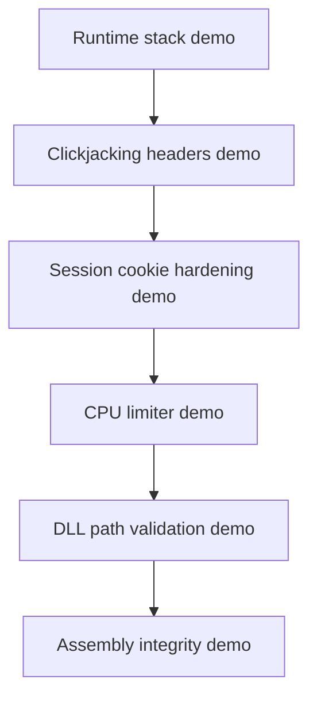

# Atelier 00 - Rappels securite applicative .NET

Cet atelier conserve uniquement les demonstrations avec comportement observable dans le code (pas de endpoints purement descriptifs).

## Pre-requis

- Etre positionne a la racine du depot `sdne`
- Windows 10/11 ou Windows Server recent
- PowerShell 5.1+
- .NET SDK 10.x
- Port `5100` libre

Verification de l'environnement:

```powershell
$PSVersionTable.PSVersion
dotnet --version
```

Resultat attendu:

- `PowerShell` >= 5.1
- `dotnet` commence par `10.`

## Etape 1 - Initialiser l'atelier

Objectif: restaurer les dependances et compiler le projet.

Code source a observer:
- `00/SecurityFoundationsLab/SecurityFoundationsLab.csproj:4`
- `00/SecurityFoundationsLab/Program.cs:4`

```powershell
if (Test-Path .\00) { Set-Location .\00 }
dotnet restore .\Atelier00.slnx
dotnet build .\Atelier00.slnx
```

Resultat attendu: build reussi sans erreur.

## Etape 2 - Lancer l'API de demo

Objectif: demarrer l'API locale.

Code source a observer:
- `00/SecurityFoundationsLab/Program.cs:10`
- `00/SecurityFoundationsLab/Program.cs:23`

```powershell
$BaseUrl = 'http://localhost:5100'
dotnet run --project .\SecurityFoundationsLab\SecurityFoundationsLab.csproj --urls=$BaseUrl
```

Resultat attendu: message `Now listening on: http://localhost:5100`.

## Etape 3 - Stack: recursion controlee

Objectif: observer la croissance de pile sans crash.

Code source a observer:
- `00/SecurityFoundationsLab/Program.cs:47`
- `00/SecurityFoundationsLab/Program.cs:65`
- `00/SecurityFoundationsLab/Program.cs:213`

```powershell
$BaseUrl = 'http://localhost:5100'
Invoke-RestMethod -Uri "$BaseUrl/runtime/stack-depth?depth=20" -Method Get
Invoke-RestMethod -Uri "$BaseUrl/runtime/stack-depth?depth=200000" -Method Get
```

Resultat attendu: `observedFrames` augmente avec `depth`.

## Etape 4 - StackOverflowException en processus isole

Objectif: constater l'arret brutal d'un processus sur recursion infinie.

Code source a observer:
- `00/samples/StackOverflowDemo/Program.cs:5`
- `00/samples/StackOverflowDemo/Program.cs:11`

```powershell
if (Test-Path .\00\samples\StackOverflowDemo) { Set-Location .\00\samples\StackOverflowDemo } elseif (Test-Path .\samples\StackOverflowDemo) { Set-Location .\samples\StackOverflowDemo }
dotnet run
```

Resultat attendu:
- le processus termine avec `StackOverflowException`
- pas de recuperation possible via `try/catch`

## Etape 5 - Clickjacking: comparer vuln vs secure

Objectif: verifier l'ajout des en-tetes de protection.

Code source a observer:
- `00/SecurityFoundationsLab/Program.cs:71`
- `00/SecurityFoundationsLab/Program.cs:77`

```powershell
$BaseUrl = 'http://localhost:5100'

$vuln = Invoke-WebRequest -Uri "$BaseUrl/vuln/clickjacking/page" -Method Get
$secure = Invoke-WebRequest -Uri "$BaseUrl/secure/clickjacking/page" -Method Get

$vuln.Headers['X-Frame-Options']
$secure.Headers['X-Frame-Options']
$secure.Headers['Content-Security-Policy']
```

Resultat attendu:
- `vuln`: en-tetes absents
- `secure`: `X-Frame-Options: DENY` + CSP `frame-ancestors 'none'`

## Etape 6 - Session hijacking: attributs cookie

Objectif: comparer la creation de session vuln/secure.

Code source a observer:
- `00/SecurityFoundationsLab/Program.cs:86`
- `00/SecurityFoundationsLab/Program.cs:104`

```powershell
$BaseUrl = 'http://localhost:5100'
$body = @{ username = 'alice' } | ConvertTo-Json

$vuln = Invoke-WebRequest -Uri "$BaseUrl/vuln/session/login" -Method Post -ContentType 'application/json' -Body $body
$secure = Invoke-WebRequest -Uri "$BaseUrl/secure/session/login" -Method Post -ContentType 'application/json' -Body $body

$vuln.Headers['Set-Cookie']
$secure.Headers['Set-Cookie']
```

Resultat attendu:
- `vuln`: cookie permissif
- `secure`: `HttpOnly`, `Secure`, `SameSite=Strict`

## Etape 7 - Hijacking de ressources CPU

Objectif: comparer charge non limitee et charge gouvernee.

Code source a observer:
- `00/SecurityFoundationsLab/Program.cs:122`
- `00/SecurityFoundationsLab/Program.cs:143`
- `00/SecurityFoundationsLab/Program.cs:225`

```powershell
$BaseUrl = 'http://localhost:5100'
Invoke-RestMethod -Uri "$BaseUrl/vuln/resource/cpu?seconds=5" -Method Get
Invoke-RestMethod -Uri "$BaseUrl/secure/resource/cpu?seconds=5" -Method Get
```

Resultat attendu:
- `vuln`: accepte des durees plus larges
- `secure`: duree restreinte + throttling (`429` si surcharge)

## Etape 8 - DLL hijacking: chemin non fiable vs chemin de confiance

Objectif: verifier la validation de chemin absolu et de repertoire de confiance.

Code source a observer:
- `00/SecurityFoundationsLab/Program.cs:176`
- `00/SecurityFoundationsLab/Program.cs:190`
- `00/SecurityFoundationsLab/Program.cs:15`

```powershell
$BaseUrl = 'http://localhost:5100'
Invoke-RestMethod -Uri "$BaseUrl/vuln/dll/search-order?dllName=crypto.dll" -Method Get

$DemoDll = Join-Path (Resolve-Path .\00\SecurityFoundationsLab\bin\Debug\net10.0).Path 'trusted-dll\safe-demo.dll'
Invoke-RestMethod -Uri "$BaseUrl/secure/dll/search-order?fullPath=$([uri]::EscapeDataString($DemoDll))" -Method Get

try {
    Invoke-RestMethod -Uri "$BaseUrl/secure/dll/search-order?fullPath=$([uri]::EscapeDataString('C:\Temp\evil.dll'))" -Method Get -ErrorAction Stop
} catch {
    $_.Exception.Response.StatusCode.value__
}
```

Resultat attendu:
- `vuln`: resolution basee sur environnement/PATH
- `secure`: refuse DLL hors `trusted-dll`

## Etape 9 - Integrite assembly

Objectif: observer des metadonnees d'integrite de l'assembly charge.

Code source a observer:
- `00/SecurityFoundationsLab/Program.cs:218`

```powershell
$BaseUrl = 'http://localhost:5100'
Invoke-RestMethod -Uri "$BaseUrl/secure/assembly/integrity" -Method Get
```

Resultat attendu:
- nom/version de l'assembly
- indicateur `hasPublicKeyToken`

## Etape 10 - SAST et DAST appliques a cette API

Objectif: executer des controles statiques et dynamiques sur le module.

Code source a observer:
- `00/SecurityFoundationsLab/Program.cs:71`
- `00/SecurityFoundationsLab/Program.cs:122`

```powershell
if (Test-Path .\00) { Set-Location .\00 }
dotnet build .\SecurityFoundationsLab\SecurityFoundationsLab.csproj -warnaserror

$BaseUrl = 'http://localhost:5100'
Invoke-WebRequest -Uri "$BaseUrl/secure/clickjacking/page" -Method Get | Select-Object StatusCode,Headers
Invoke-RestMethod -Uri "$BaseUrl/secure/resource/cpu?seconds=2" -Method Get
```

Resultat attendu:
- build stricte reussie
- checks runtime reussis sur endpoints secure

## Etape 11 - Mitigations processus Windows

Objectif: inspecter les mitigations actives du processus.

Code source a observer:
- `00/SecurityFoundationsLab/Program.cs:143`

```powershell
Get-Process -Name SecurityFoundationsLab
Get-ProcessMitigation -Name SecurityFoundationsLab
```

Resultat attendu:
- etat des mitigations (DEP/ASLR/CFG selon OS et configuration)

## Verifications

- Chaque endpoint conserve produit un effet observable (headers, cookies, throttling, validation, metadonnees).
- Aucun endpoint de simple restitution theorique n'est utilise dans le parcours.

## Depannage

- Si `Connection refused`, verifier que l'API tourne sur `http://localhost:5100`.
- Si `safe-demo.dll` est introuvable, lancer l'API une fois puis relancer l'etape 8.
- Si `Get-ProcessMitigation` ne retourne rien, verifier le nom via `Get-Process`.

## Nettoyage / Reset

```powershell
# Dans le terminal API
# Ctrl+C

if (Test-Path .\00) { Set-Location .\00 }
dotnet clean .\Atelier00.slnx
```

## Diagramme Mermaid


