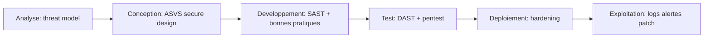
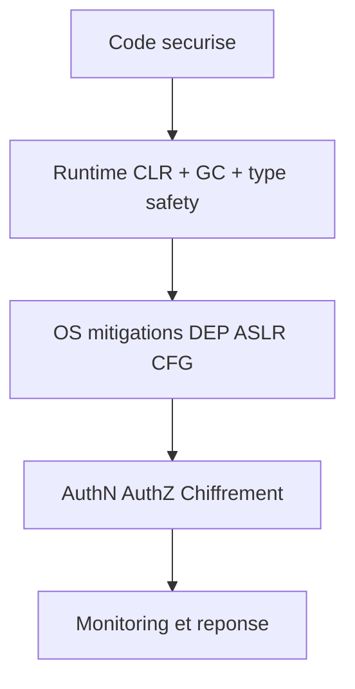

# Atelier 00 - Rappels securite applicative .NET

Cet atelier pose les bases techniques utilisees dans tous les autres ateliers.
Il couvre la pile d'execution, l'analyse de code, le hijacking de ressources, les overflows et les protections runtime.

## Pre-requis

- Etre positionne a la racine du depot `sdne`
- Windows 10/11 ou Windows Server recent
- PowerShell 5.1+
- .NET SDK 9.x
- Port `5100` libre

Verification de l'environnement:

```powershell
`$PSVersionTable.PSVersion
dotnet --version
```

Resultat attendu:

- `pwsh` >= 7
- `dotnet` commence par `9.`

## Etape 1 - Initialiser l'atelier

Objectif: restaurer les dependances et compiler le projet.

```powershell
if\ \(Test-Path\ \.\00\)\ \{\ Set-Location\ \.\00\ }
dotnet restore .\Atelier00.slnx
dotnet build .\Atelier00.slnx
```

Resultat attendu: build reussi sans erreur.

## Etape 2 - Lancer l'API de rappel securite

Objectif: demarrer l'API locale pour les demonstrations `vuln` vs `secure`.

```powershell
$BaseUrl = 'http://localhost:5100'
dotnet run --project .\SecurityFoundationsLab\SecurityFoundationsLab.csproj --urls=$BaseUrl
```

Resultat attendu: message `Now listening on: http://localhost:5100`.

## Etape 3 - Verifier l'agenda et le cycle de vie securite

Objectif: visualiser l'approche secure-by-design et shift-left.

Executer dans un second terminal PowerShell:

```powershell
$BaseUrl = 'http://localhost:5100'
Invoke-RestMethod -Uri "$BaseUrl/" -Method Get
Invoke-RestMethod -Uri "$BaseUrl/security/lifecycle" -Method Get
```

Resultat attendu:

- agenda des themes de l'atelier
- phases du cycle: analyse, conception, developpement, test, deploiement, exploitation

## Etape 4 - Pile d'execution: stack vs heap

Objectif: comprendre la distinction stack/heap et observer une recursion controlee.

```powershell
$BaseUrl = 'http://localhost:5100'
Invoke-RestMethod -Uri "$BaseUrl/runtime/stack-vs-heap" -Method Get
Invoke-RestMethod -Uri "$BaseUrl/runtime/stack-depth?depth=20" -Method Get
```

Resultat attendu:

- rappel stack vs heap
- demonstration de pile avec profondeur limitee

## Etape 5 - Observer StackOverflowException dans un processus isole

Objectif: constater qu'un stack overflow arrete brutalement le processus.

1. Creer un mini programme de test.

```powershell
if\ \(Test-Path\ \.\00\)\ \{\ Set-Location\ \.\00\ }
New-Item -ItemType Directory -Force .\tmp\StackOverflowDemo | Out-Null
@"
using System;

static class Program
{
    static void Recursive() => Recursive();

    static void Main()
    {
        Console.WriteLine("Debut recursion infinie...");
        Recursive();
    }
}
"@ | Set-Content .\tmp\StackOverflowDemo\Program.cs
```

2. Creer le projet puis executer dans un processus dedie.

```powershell
if (Test-Path .\00\tmp\StackOverflowDemo) { if\ \(Test-Path\ \.\00\)\ \{\ Set-Location\ \.\00\ }\tmp\StackOverflowDemo } elseif (Test-Path .\tmp\StackOverflowDemo) { Set-Location .\tmp\StackOverflowDemo }
@"
<Project Sdk="Microsoft.NET.Sdk">
  <PropertyGroup>
    <OutputType>Exe</OutputType>
    <TargetFramework>net9.0</TargetFramework>
    <ImplicitUsings>enable</ImplicitUsings>
    <Nullable>enable</Nullable>
  </PropertyGroup>
</Project>
"@ | Set-Content .\StackOverflowDemo.csproj

dotnet run
```

Resultat attendu:

- le processus se termine brutalement avec `StackOverflowException`
- exception non recuperable par `try/catch`

## Etape 6 - SAST (analyse statique)

Objectif: executer des controles statiques reproductibles.

```powershell
if\ \(Test-Path\ \.\00\)\ \{\ Set-Location\ \.\00\ }
dotnet build .\SecurityFoundationsLab\SecurityFoundationsLab.csproj -warnaserror
dotnet list .\SecurityFoundationsLab\SecurityFoundationsLab.csproj package --vulnerable
```

Resultat attendu:

- build stricte sans warning
- rapport des packages vulnerables (si none, signalement propre)

## Etape 7 - DAST (analyse dynamique)

Objectif: simuler des tests boite noire sur endpoints exposes.

```powershell
$BaseUrl = 'http://localhost:5100'
Invoke-RestMethod -Uri "$BaseUrl/analysis/sast-dast" -Method Get

Invoke-WebRequest -Uri "$BaseUrl/vuln/clickjacking/page" -Method Get | Select-Object StatusCode
Invoke-WebRequest -Uri "$BaseUrl/secure/clickjacking/page" -Method Get | Select-Object StatusCode,Headers
```

Resultat attendu:

- endpoint `secure/clickjacking/page` retourne des en-tetes anti-clickjacking

## Etape 8 - Session hijacking: comparer cookie vuln vs secure

Objectif: observer les attributs de cookie de session.

```powershell
$BaseUrl = 'http://localhost:5100'
$body = @{ username = 'alice' } | ConvertTo-Json

$vuln = Invoke-WebRequest -Uri "$BaseUrl/vuln/session/login" -Method Post -ContentType 'application/json' -Body $body
$vuln.Headers['Set-Cookie']

$secure = Invoke-WebRequest -Uri "$BaseUrl/secure/session/login" -Method Post -ContentType 'application/json' -Body $body
$secure.Headers['Set-Cookie']
```

Resultat attendu:

- cookie `vuln`: sans `HttpOnly`/`Secure` robustes
- cookie `secure`: `HttpOnly`, `Secure`, `SameSite=Strict`

## Etape 9 - Hijacking de ressources (CPU)

Objectif: comparer consommation non limitee et controlee.

```powershell
$BaseUrl = 'http://localhost:5100'
Invoke-RestMethod -Uri "$BaseUrl/vuln/resource/cpu?seconds=2" -Method Get
Invoke-RestMethod -Uri "$BaseUrl/secure/resource/cpu?seconds=2" -Method Get
```

Resultat attendu:

- `vuln` accepte facilement la charge
- `secure` applique quotas et limites

## Etape 10 - DLL hijacking: chemin non fiable vs chemin restreint

Objectif: verifier la validation de chemin et de repertoire de confiance.

```powershell
$BaseUrl = 'http://localhost:5100'
Invoke-RestMethod -Uri "$BaseUrl/vuln/dll/search-order?dllName=crypto.dll" -Method Get

# Construire un chemin absolu vers la DLL de demonstration creee par l'application
$DemoDll = Join-Path (Resolve-Path .\00\SecurityFoundationsLab\bin\Debug\net9.0).Path 'trusted-dll\safe-demo.dll'
Invoke-RestMethod -Uri "$BaseUrl/secure/dll/search-order?fullPath=$([uri]::EscapeDataString($DemoDll))" -Method Get

try {
    Invoke-RestMethod -Uri "$BaseUrl/secure/dll/search-order?fullPath=$([uri]::EscapeDataString('C:\Temp\evil.dll'))" -Method Get -ErrorAction Stop
} catch {
    $_.Exception.Response.StatusCode.value__
}
```

Resultat attendu:

- mode `vuln`: dependant de l'environnement/PATH
- mode `secure`: accepte uniquement chemin absolu dans repertoire de confiance

## Etape 11 - Protections runtime et integrite assembly

Objectif: inventorier les defenses runtime et verifier l'integrite de l'assembly.

```powershell
$BaseUrl = 'http://localhost:5100'
Invoke-RestMethod -Uri "$BaseUrl/runtime/protections" -Method Get
Invoke-RestMethod -Uri "$BaseUrl/secure/assembly/integrity" -Method Get
```

Resultat attendu:

- liste DEP/ASLR/CFG/SafeSEH/Signatures
- metadonnees assembly et indicateur de token de cle publique

## Etape 12 - Cartographier les mitigations processus Windows

Objectif: voir les mitigations effectives du processus en execution.

```powershell
Get-Process -Name SecurityFoundationsLab
Get-ProcessMitigation -Name SecurityFoundationsLab
```

Resultat attendu:

- presence des politiques de mitigation (DEP, ASLR, CFG selon environnement)

## Comparatif SAST vs DAST

| Critere | SAST | DAST |
|---|---|---|
| Moment | Pendant le developpement | Sur application en execution |
| Source d'analyse | Code source / binaire | Requetes HTTP / comportement |
| Forces | Detection precoce, couverture large | Detection runtime, configuration et flux reels |
| Limites | Faux positifs possibles | Couverture limitee aux cas testes |
| Usage recommande | CI/CD a chaque commit | Campagnes regulieres pre-prod et prod controlee |

## Verifications

- Les endpoints `vuln/*` exposent des anti-patterns controlables.
- Les endpoints `secure/*` appliquent des contre-mesures explicites.
- Le cycle de vie securite est visible via `/security/lifecycle`.
- Les tests SAST/DAST locaux sont reproductibles.

## Depannage

- Si `Connection refused`, verifier que l'API tourne sur `http://localhost:5100`.
- Si `Get-ProcessMitigation` ne retourne rien, verifier le nom du processus avec `Get-Process`.
- Si le chemin `safe-demo.dll` est introuvable, lancer au moins une fois l'API puis relancer l'etape 10.
- Si `dotnet run` sur la demo stack overflow echoue, verifier que `net9.0` est installe.

## Nettoyage / Reset

```powershell
# Dans le terminal API
# Ctrl+C

if\ \(Test-Path\ \.\00\)\ \{\ Set-Location\ \.\00\ }
dotnet clean .\Atelier00.slnx
Remove-Item -Recurse -Force .\tmp -ErrorAction SilentlyContinue
```

## Diagrammes Mermaid

Cycle de vie securite:



Defense en profondeur .NET:




