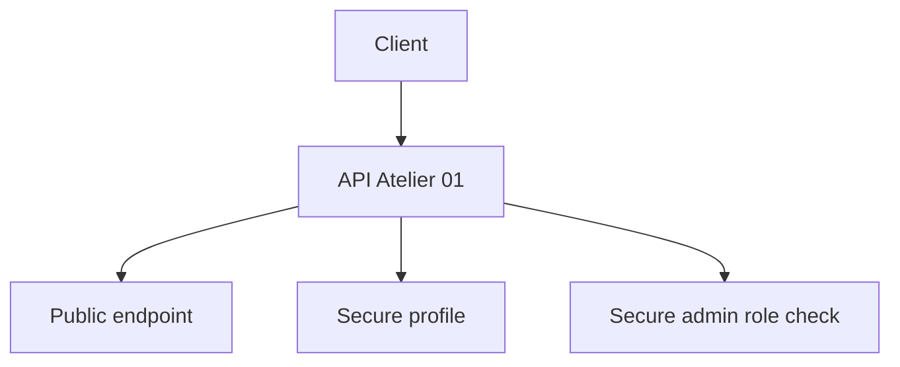

# Atelier 01 - HTTP Basic Auth

## Pre-requis

- Etre positionne a la racine du depot `sdne`
- .NET SDK 9.x installe
- PowerShell 7+

## Etape 1 - Initialiser l'atelier

Objectif: restaurer les dependances et preparer l'execution locale.

```powershell
Set-Location .\01
dotnet restore .\BasicAuthWorkshop\BasicAuthWorkshop.csproj
```

Resultat attendu: restauration terminee sans erreur.

## Etape 2 - Lancer l'API

Objectif: demarrer le service localement sur un port fixe.

```powershell
$BaseUrl = 'http://localhost:5101'
dotnet run --project .\BasicAuthWorkshop\BasicAuthWorkshop.csproj --urls=$BaseUrl
```

Resultat attendu: message `Now listening on: http://localhost:5101`.

## Etape 3 - Tester endpoint public

Objectif: verifier l'acces anonyme.

Execution dans un second terminal PowerShell (laisser l'API active):

```powershell
$BaseUrl = 'http://localhost:5101'
Invoke-RestMethod -Uri "$BaseUrl/public" -Method Get
```

Resultat attendu: reponse JSON avec `resource = public`.

## Etape 4 - Tester endpoint protege sans authentification

Objectif: observer le refus d'acces.

```powershell
$BaseUrl = 'http://localhost:5101'
try {
    Invoke-RestMethod -Uri "$BaseUrl/secure/profile" -Method Get -ErrorAction Stop
} catch {
    $_.Exception.Response.StatusCode.value__
}
```

Resultat attendu: code HTTP `401`.

## Etape 5 - Tester HTTP Basic utilisateur standard

Objectif: acceder a la ressource securisee avec identifiants valides.

```powershell
$BaseUrl = 'http://localhost:5101'
$pair = 'analyst:Passw0rd!'
$token = [Convert]::ToBase64String([Text.Encoding]::ASCII.GetBytes($pair))
$headers = @{ Authorization = "Basic $token" }
Invoke-RestMethod -Uri "$BaseUrl/secure/profile" -Headers $headers -Method Get
```

Resultat attendu: reponse JSON contenant `user` et `roles`.

## Etape 6 - Tester policy AdminOnly

Objectif: comparer un compte non admin et un compte admin.

```powershell
$BaseUrl = 'http://localhost:5101'

$tokenUser = [Convert]::ToBase64String([Text.Encoding]::ASCII.GetBytes('analyst:Passw0rd!'))
$headersUser = @{ Authorization = "Basic $tokenUser" }
try {
    Invoke-RestMethod -Uri "$BaseUrl/secure/admin" -Headers $headersUser -Method Get -ErrorAction Stop
} catch {
    $_.Exception.Response.StatusCode.value__
}

$tokenAdmin = [Convert]::ToBase64String([Text.Encoding]::ASCII.GetBytes('admin:Adm1nPass!'))
$headersAdmin = @{ Authorization = "Basic $tokenAdmin" }
Invoke-RestMethod -Uri "$BaseUrl/secure/admin" -Headers $headersAdmin -Method Get
```

Resultat attendu:

- premier appel: `403`
- second appel: JSON avec message d'acces admin.

## Verifications

- `401` sans credentials
- `200` sur `/secure/profile` avec credentials valides
- `403` puis `200` sur `/secure/admin` selon role

## Depannage

- Si tous les acces renvoient `401`, verifier la valeur de l'en-tete `Authorization`.
- Si `Connection refused`, verifier que l'API ecoute bien sur `http://localhost:5101`.

## Nettoyage / Reset

```powershell
# Dans le terminal API
# Ctrl+C

Set-Location .\01
dotnet clean .\BasicAuthWorkshop\BasicAuthWorkshop.csproj
```

## Diagramme Mermaid


