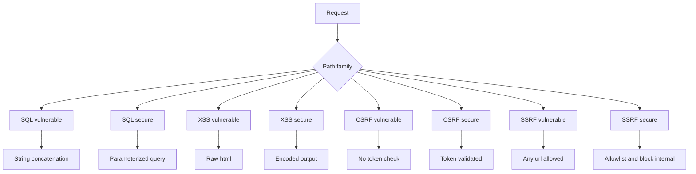

# Atelier 02 - SQLi, XSS, CSRF, SSRF

## But

Reproduire quatre classes de failles web, puis verifier les contre-mesures implementees.

## Demarrage

```powershell
cd .\02\AppSecWorkshop02
dotnet run
```

## Mode operatoire

### Etape 1 - SQL Injection

Action:
- Envoyer un payload SQL dans `username`.

Requete vulnerable:
```http
GET /vuln/sql/users?username=' OR 1=1 -- HTTP/1.1
Host: localhost
```

Requete corrigee:
```http
GET /secure/sql/users?username=' OR 1=1 -- HTTP/1.1
Host: localhost
```

Resultat attendu:
- `vuln`: plusieurs utilisateurs remontent.
- `secure`: pas d'escalade, resultat filtre.

Point a observer:
- difference entre concatener SQL et parametrer SQL.

### Etape 2 - XSS

Requete vulnerable:
```http
GET /vuln/xss?input=<script>alert('xss')</script> HTTP/1.1
Host: localhost
```

Requete corrigee:
```http
GET /secure/xss?input=<script>alert('xss')</script> HTTP/1.1
Host: localhost
```

Resultat attendu:
- `vuln`: script injecte dans la reponse HTML.
- `secure`: payload encode (`&lt;script&gt;`).

Point a observer:
- encoder la sortie selon le contexte HTML.

### Etape 3 - CSRF

Action 1: creer une session.
```http
POST /auth/login HTTP/1.1
Host: localhost
Content-Type: application/json

{"username":"alice"}
```

Recuperer:
- cookie `session-id`
- valeur `csrfToken` dans la reponse.

Action 2: appel sans token CSRF.
```http
POST /vuln/csrf/transfer HTTP/1.1
Host: localhost
Content-Type: application/json
Cookie: session-id=...

{"to":"mallory","amount":100}
```

Action 3: appel securise sans puis avec token.
```http
POST /secure/csrf/transfer HTTP/1.1
Host: localhost
Content-Type: application/json
Cookie: session-id=...

{"to":"mallory","amount":100}
```

```http
POST /secure/csrf/transfer HTTP/1.1
Host: localhost
Content-Type: application/json
Cookie: session-id=...
X-CSRF-Token: <csrfToken>

{"to":"mallory","amount":100}
```

Resultat attendu:
- sans token: `403`
- avec token: `200`

### Etape 4 - SSRF

Requete vulnerable:
```http
GET /vuln/ssrf/fetch?url=http://example.com HTTP/1.1
Host: localhost
```

Requete corrigee bloquee:
```http
GET /secure/ssrf/fetch?url=http://localhost:5142 HTTP/1.1
Host: localhost
```

Requete corrigee autorisee:
```http
GET /secure/ssrf/fetch?url=https://jsonplaceholder.typicode.com/todos/1 HTTP/1.1
Host: localhost
```

Resultat attendu:
- blocage des cibles non autorisees.
- acceptation des hosts en allowlist.

## Reexecution rapide

- Utiliser `AppSecWorkshop02.http`.
- Rejouer chaque couple `vuln` / `secure`.

## Script PowerShell des appels Web Service

```powershell
cd .\02
.\scripts\calls.ps1
```

## Diagramme Mermaid


