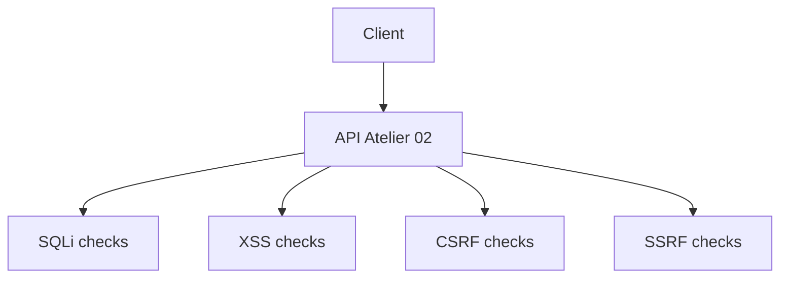

# Atelier 02 - SQLi, XSS, CSRF, SSRF

## Pre-requis

- Etre positionne a la racine du depot `sdne`
- .NET SDK 9.x installe
- PowerShell 7+

## Etape 1 - Initialiser et lancer l'API

Objectif: restaurer, compiler et lancer l'atelier.

```powershell
Set-Location .\02
dotnet restore .\AppSecWorkshop02\AppSecWorkshop02.csproj
$BaseUrl = 'http://localhost:5102'
dotnet run --project .\AppSecWorkshop02\AppSecWorkshop02.csproj --urls=$BaseUrl
```

Resultat attendu: API active sur `http://localhost:5102`.

## Etape 2 - SQL Injection: comparer vuln vs secure

Objectif: visualiser la difference entre requete concatenee et requete parametree.

```powershell
$BaseUrl = 'http://localhost:5102'
$payload = "alice' OR 1=1 --"

Invoke-RestMethod -Uri "$BaseUrl/vuln/sql/users?username=$([uri]::EscapeDataString($payload))" -Method Get
Invoke-RestMethod -Uri "$BaseUrl/secure/sql/users?username=$([uri]::EscapeDataString($payload))" -Method Get
```

Resultat attendu:

- `vuln`: plusieurs utilisateurs peuvent etre renvoyes
- `secure`: pas de contournement SQL

## Etape 3 - XSS reflechi

Objectif: comparer sortie HTML non encodee vs encodee.

```powershell
$BaseUrl = 'http://localhost:5102'
$payload = '<script>alert("xss")</script>'

Invoke-WebRequest -Uri "$BaseUrl/vuln/xss?input=$([uri]::EscapeDataString($payload))" -Method Get | Select-Object -ExpandProperty Content
Invoke-WebRequest -Uri "$BaseUrl/secure/xss?input=$([uri]::EscapeDataString($payload))" -Method Get | Select-Object -ExpandProperty Content
```

Resultat attendu:

- `vuln`: balise script presente telle quelle
- `secure`: contenu encode HTML

## Etape 4 - CSRF

Objectif: reproduire un transfert sans token puis avec token valide.

```powershell
$BaseUrl = 'http://localhost:5102'
$session = New-Object Microsoft.PowerShell.Commands.WebRequestSession

$loginBody = @{ username = 'alice' } | ConvertTo-Json
$login = Invoke-RestMethod -Uri "$BaseUrl/auth/login" -Method Post -WebSession $session -ContentType 'application/json' -Body $loginBody
$csrf = $login.csrfToken

$transferBody = @{ to = 'bob'; amount = 150 } | ConvertTo-Json

Invoke-RestMethod -Uri "$BaseUrl/vuln/csrf/transfer" -Method Post -WebSession $session -ContentType 'application/json' -Body $transferBody

try {
    Invoke-RestMethod -Uri "$BaseUrl/secure/csrf/transfer" -Method Post -WebSession $session -ContentType 'application/json' -Body $transferBody -ErrorAction Stop
} catch {
    $_.Exception.Response.StatusCode.value__
}

$headers = @{ 'X-CSRF-Token' = $csrf }
Invoke-RestMethod -Uri "$BaseUrl/secure/csrf/transfer" -Method Post -WebSession $session -Headers $headers -ContentType 'application/json' -Body $transferBody
```

Resultat attendu:

- endpoint `vuln`: accepte sans token
- endpoint `secure`: refuse sans token (`403`), accepte avec token correct

## Etape 5 - SSRF

Objectif: verifier le filtrage d'URL sortante.

```powershell
$BaseUrl = 'http://localhost:5102'
Invoke-RestMethod -Uri "$BaseUrl/vuln/ssrf/fetch?url=$([uri]::EscapeDataString('https://example.com'))" -Method Get
Invoke-RestMethod -Uri "$BaseUrl/secure/ssrf/fetch?url=$([uri]::EscapeDataString('https://example.com'))" -Method Get

try {
    Invoke-RestMethod -Uri "$BaseUrl/secure/ssrf/fetch?url=$([uri]::EscapeDataString('http://127.0.0.1:80'))" -Method Get -ErrorAction Stop
} catch {
    $_.Exception.Response.StatusCode.value__
}
```

Resultat attendu: URL sensible/localhost rejetee sur endpoint `secure`.

## Verifications

- SQLi observable sur `vuln`, bloquee sur `secure`
- XSS encode sur `secure`
- CSRF protege par en-tete `X-CSRF-Token`
- SSRF controle par validation d'URL

## Depannage

- Si `403` sur transfert secure avec token, verifier l'en-tete exact `X-CSRF-Token`.
- Si erreur base SQLite, relancer l'API pour reinitialiser `workshop.db`.

## Nettoyage / Reset

```powershell
# Dans le terminal API
# Ctrl+C

Set-Location .\02
Remove-Item .\workshop.db -ErrorAction SilentlyContinue
dotnet clean .\AppSecWorkshop02\AppSecWorkshop02.csproj
```

## Diagramme Mermaid


