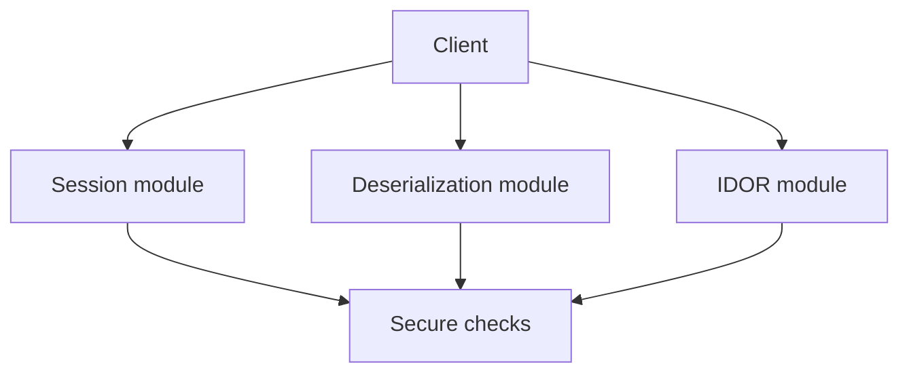

# Atelier 03 - Session, Deserialisation, IDOR (.NET Framework 4.8)

## Mode compatibilite NET48

Cette variante est executable en .NET Framework 4.8 avec un hote HTTP de compatibilite. Les routes des ateliers NET10 sont reprises (methodes + chemins), avec des comportements vulnerables/securises reproduits en mode pedagogique net48.

## Pre-requis

- Etre positionne a la racine du depot `sdne`
- .NET Framework 4.8 (Developer Pack) installe
- PowerShell 5.1+

## Etape 1 - Initialiser et lancer

Objectif: demarrer l'API de l'atelier.

Code source a observer:
- `03-NET48/AppSecWorkshop03/Program.cs:19`
- `03-NET48/AppSecWorkshop03/Security/VulnerableSessionService.cs:7`
- `03-NET48/AppSecWorkshop03/Security/SecureSessionService.cs:9`

```powershell
if (Test-Path .\03-NET48) { Set-Location .\03-NET48 }
dotnet restore .\AppSecWorkshop03\AppSecWorkshop03.csproj
$BaseUrl = 'http://localhost:5103'
dotnet run --project .\AppSecWorkshop03\AppSecWorkshop03.csproj --urls=$BaseUrl
```

Resultat attendu: API active sur `http://localhost:5103`.

## Etape 2 - Session theft (token)

Objectif: comparer validation faible et validation renforcee.

Code source a observer:
- `03-NET48/AppSecWorkshop03/Program.cs:26`
- `03-NET48/AppSecWorkshop03/Program.cs:47`
- `03-NET48/AppSecWorkshop03/Security/SecureSessionService.cs:22`

```powershell
$BaseUrl = 'http://localhost:5103'
$loginBody = @{ username = 'alice' } | ConvertTo-Json

$vulnLogin = Invoke-RestMethod -Uri "$BaseUrl/vuln/session/login" -Method Post -ContentType 'application/json' -Body $loginBody
$vulnToken = $vulnLogin.token
Invoke-RestMethod -Uri "$BaseUrl/vuln/session/profile?token=$vulnToken" -Method Get

$secureLogin = Invoke-RestMethod -Uri "$BaseUrl/secure/session/login" -Method Post -ContentType 'application/json' -Headers @{ 'User-Agent' = 'WorkshopAgent/1.0' } -Body $loginBody
$secureToken = $secureLogin.token
Invoke-RestMethod -Uri "$BaseUrl/secure/session/profile" -Method Get -Headers @{ 'X-Session-Token' = $secureToken; 'User-Agent' = 'WorkshopAgent/1.0' }
```

Resultat attendu: profile secure valide seulement avec token + contexte attendu.

## Etape 3 - Deserialisation

Objectif: tester endpoint vulnerable puis endpoint securise.

Code source a observer:
- `03-NET48/AppSecWorkshop03/Program.cs:75`
- `03-NET48/AppSecWorkshop03/Program.cs:94`
- `03-NET48/AppSecWorkshop03/Serialization/WorkshopActions.cs:5`

```powershell
$BaseUrl = 'http://localhost:5103'

$safeBody = @{ action = 'echo'; message = 'hello' } | ConvertTo-Json
Invoke-RestMethod -Uri "$BaseUrl/secure/deserialization/execute" -Method Post -ContentType 'application/json' -Body $safeBody

$badBody = @{ action = 'delete-all'; message = 'x' } | ConvertTo-Json
try {
    Invoke-RestMethod -Uri "$BaseUrl/secure/deserialization/execute" -Method Post -ContentType 'application/json' -Body $badBody -ErrorAction Stop
} catch {
    $_.Exception.Response.StatusCode.value__
}
```

Resultat attendu: seule l'action `echo` est acceptee en mode secure.

## Etape 4 - IDOR

Objectif: verifier qu'un utilisateur ne lit pas une ressource qui ne lui appartient pas.

Code source a observer:
- `03-NET48/AppSecWorkshop03/Program.cs:108`
- `03-NET48/AppSecWorkshop03/Program.cs:124`
- `03-NET48/AppSecWorkshop03/Data/OrderRepository.cs:3`

```powershell
$BaseUrl = 'http://localhost:5103'

Invoke-RestMethod -Uri "$BaseUrl/vuln/idor/orders/2?username=alice" -Method Get

try {
    Invoke-RestMethod -Uri "$BaseUrl/secure/idor/orders/2?username=alice" -Method Get -ErrorAction Stop
} catch {
    $_.Exception.Response.StatusCode.value__
}

Invoke-RestMethod -Uri "$BaseUrl/secure/idor/orders/2?username=admin" -Method Get
```

Resultat attendu:

- `vuln`: acces direct possible
- `secure`: `403` pour utilisateur non autorise, acces admin autorise

## Verifications

- Token vulnerable reutilisable facilement
- Validation secure impose en-tete token
- Actions de deserialisation whitelistes
- Controle d'acces objet actif sur endpoint secure

## Depannage

- Si `401` sur `/secure/session/profile`, verifier `X-Session-Token` et `User-Agent`.
- Si `404` sur commandes IDOR, utiliser un id existant (ex: `1` ou `2`).

## Nettoyage / Reset

```powershell
# Dans le terminal API
# Ctrl+C

if (Test-Path .\03-NET48) { Set-Location .\03-NET48 }
dotnet clean .\AppSecWorkshop03\AppSecWorkshop03.csproj
```

## Diagramme Mermaid




