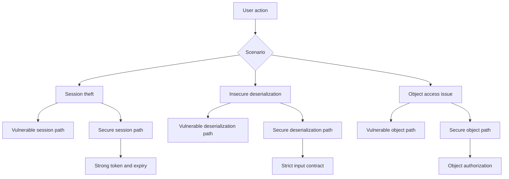

# Atelier 03 - Session theft, deserialisation, IDOR

## But

Analyser des attaques avancees et verifier les controles applicatifs associes.

## Demarrage

```powershell
cd .\03\AppSecWorkshop03
dotnet run
```

## Mode operatoire

### Etape 1 - Vol de session

Action 1: obtenir un token vulnerable.
```http
POST /vuln/session/login HTTP/1.1
Host: localhost
Content-Type: application/json

{"username":"alice"}
```

Action 2: reutiliser un token previsible.
```http
GET /vuln/session/profile?token=YWxpY2U6d29ya3Nob3Atc2Vzc2lvbg== HTTP/1.1
Host: localhost
```

Action 3: comparer avec le flux securise.
- `POST /secure/session/login`
- `GET /secure/session/profile` avec `X-Session-Token`

Point a observer:
- token fort + expiration + contexte client.

### Etape 2 - Deserialisation non sure

Requete vulnerable:
```http
POST /vuln/deserialization/execute HTTP/1.1
Host: localhost
Content-Type: application/json

{
  "$type":"AppSecWorkshop03.Serialization.DangerousAction, AppSecWorkshop03",
  "FileName":"owned-by-deserialization.txt",
  "Content":"Payload deserialize"
}
```

Requete corrigee:
```http
POST /secure/deserialization/execute HTTP/1.1
Host: localhost
Content-Type: application/json

{"action":"echo","message":"safe payload"}
```

Resultat attendu:
- `vuln`: effet de bord (fichier cree).
- `secure`: seules actions explicitement autorisees.

### Etape 3 - IDOR

Requete vulnerable:
```http
GET /vuln/idor/orders/1002?username=alice HTTP/1.1
Host: localhost
```

Requete corrigee:
```http
GET /secure/idor/orders/1002?username=alice HTTP/1.1
Host: localhost
```

Requete admin:
```http
GET /secure/idor/orders/1002?username=bob HTTP/1.1
Host: localhost
```

Resultat attendu:
- `vuln`: lecture non autorisee possible.
- `secure`: refus pour non-proprietaire, acces admin controle.

## Reexecution rapide

- Utiliser `AppSecWorkshop03.http`.

## Script PowerShell des appels Web Service

```powershell
cd .\03
.\scripts\calls.ps1
```

## Diagramme Mermaid


