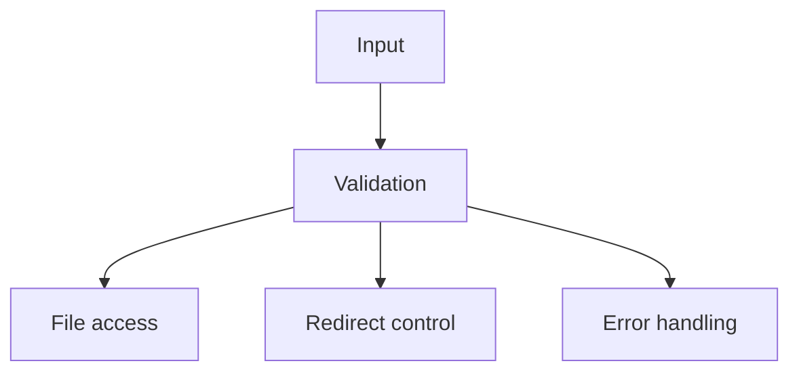

# Atelier 04 - Secure Coding et durcissement

## Pre-requis

- Etre positionne a la racine du depot `sdne`
- .NET SDK 9.x installe
- PowerShell 5.1+

## Etape 1 - Initialiser et lancer

Objectif: lancer l'API pour comparer endpoints `vuln` et `secure`.

```powershell
if\ \(Test-Path\ \.\04\)\ \{\ Set-Location\ \.\04\ }
dotnet restore .\AppSecWorkshop04\AppSecWorkshop04.csproj
$BaseUrl = 'http://localhost:5104'
dotnet run --project .\AppSecWorkshop04\AppSecWorkshop04.csproj --urls=$BaseUrl
```

Resultat attendu: API active sur `http://localhost:5104`.

## Etape 2 - Validation des entrees (register)

Objectif: constater l'absence de validation puis la validation forte.

```powershell
$BaseUrl = 'http://localhost:5104'

$weak = @{ username = 'a'; password = '123' } | ConvertTo-Json
Invoke-RestMethod -Uri "$BaseUrl/vuln/register" -Method Post -ContentType 'application/json' -Body $weak

try {
    Invoke-RestMethod -Uri "$BaseUrl/secure/register" -Method Post -ContentType 'application/json' -Body $weak -ErrorAction Stop
} catch {
    $_.Exception.Response.StatusCode.value__
}

$strong = @{ username = 'alice.secure'; password = 'Str0ng!Passw0rd' } | ConvertTo-Json
Invoke-RestMethod -Uri "$BaseUrl/secure/register" -Method Post -ContentType 'application/json' -Body $strong
```

Resultat attendu:

- `vuln/register`: accepte
- `secure/register`: rejette faible puis accepte fort

## Etape 3 - Path traversal

Objectif: comparer lecture de chemin libre vs chemin contraint.

```powershell
$BaseUrl = 'http://localhost:5104'

Invoke-RestMethod -Uri "$BaseUrl/secure/files/read?fileName=public-note.txt" -Method Get

$traversal = '..\\..\\Windows\\win.ini'
Invoke-RestMethod -Uri "$BaseUrl/vuln/files/read?path=$([uri]::EscapeDataString($traversal))" -Method Get

try {
    Invoke-RestMethod -Uri "$BaseUrl/secure/files/read?fileName=$([uri]::EscapeDataString($traversal))" -Method Get -ErrorAction Stop
} catch {
    $_.Exception.Response.StatusCode.value__
}
```

Resultat attendu: tentative traversal rejetee cote `secure`.

## Etape 4 - Open redirect

Objectif: verifier qu'une URL externe est refusee sur endpoint securise.

```powershell
$BaseUrl = 'http://localhost:5104'

Invoke-WebRequest -Uri "$BaseUrl/vuln/redirect?returnUrl=$([uri]::EscapeDataString('https://example.com'))" -MaximumRedirection 0 -ErrorAction SilentlyContinue | Select-Object StatusCode,Headers

try {
    Invoke-RestMethod -Uri "$BaseUrl/secure/redirect?returnUrl=$([uri]::EscapeDataString('https://example.com'))" -Method Get -ErrorAction Stop
} catch {
    $_.Exception.Response.StatusCode.value__
}

Invoke-RestMethod -Uri "$BaseUrl/secure/redirect?returnUrl=$([uri]::EscapeDataString('/home'))" -Method Get
```

Resultat attendu: URL externe refusee sur endpoint secure.

## Etape 5 - Gestion d'erreurs

Objectif: comparer fuite d'erreur brute et reponse maitrisee.

```powershell
$BaseUrl = 'http://localhost:5104'

try {
    Invoke-RestMethod -Uri "$BaseUrl/vuln/errors/divide-by-zero" -Method Get -ErrorAction Stop
} catch {
    $_.Exception.Response.StatusCode.value__
}

Invoke-RestMethod -Uri "$BaseUrl/secure/errors/divide-by-zero" -Method Get
```

Resultat attendu: endpoint secure renvoie une erreur controlee (`ProblemDetails`).

## Verifications

- Validation stricte sur `secure/register`
- Protection traversal sur `secure/files/read`
- Refus URL externe sur `secure/redirect`
- Erreur maitrisee sur `secure/errors/divide-by-zero`

## Depannage

- Si lecture `secure/files/read` renvoie `404`, verifier `public-note.txt`.
- Si redirection suit automatiquement, ajouter `-MaximumRedirection 0`.

## Nettoyage / Reset

```powershell
# Dans le terminal API
# Ctrl+C

if\ \(Test-Path\ \.\04\)\ \{\ Set-Location\ \.\04\ }
dotnet clean .\AppSecWorkshop04\AppSecWorkshop04.csproj
```

## Diagramme Mermaid




