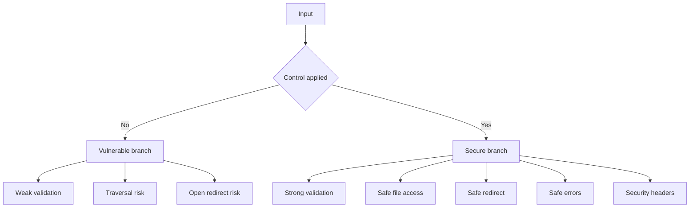

# Atelier 04 - Secure code et hardening

## But

Appliquer des controles de securite de base dans le code applicatif.

## Demarrage

```powershell
cd .\04\AppSecWorkshop04
dotnet run
```

## Mode operatoire

### Etape 1 - Validation d'entree

Requete vulnerable:
```http
POST /vuln/register HTTP/1.1
Host: localhost
Content-Type: application/json

{"username":"aa","password":"1234"}
```

Requete corrigee (meme input):
```http
POST /secure/register HTTP/1.1
Host: localhost
Content-Type: application/json

{"username":"aa","password":"1234"}
```

Requete corrigee valide:
```http
POST /secure/register HTTP/1.1
Host: localhost
Content-Type: application/json

{"username":"alice.secure","password":"S3cure!Password"}
```

### Etape 2 - Path traversal

Requete vulnerable:
```http
GET /vuln/files/read?path=..\\..\\appsettings.json HTTP/1.1
Host: localhost
```

Requete corrigee:
```http
GET /secure/files/read?fileName=public-note.txt HTTP/1.1
Host: localhost
```

Test de blocage:
```http
GET /secure/files/read?fileName=..\\..\\appsettings.json HTTP/1.1
Host: localhost
```

### Etape 3 - Open redirect

Requete vulnerable:
```http
GET /vuln/redirect?returnUrl=https://evil.example/phishing HTTP/1.1
Host: localhost
```

Requete corrigee:
```http
GET /secure/redirect?returnUrl=/dashboard HTTP/1.1
Host: localhost
```

Test de blocage:
```http
GET /secure/redirect?returnUrl=https://evil.example/phishing HTTP/1.1
Host: localhost
```

### Etape 4 - Gestion d'erreurs et headers

Requete:
```http
GET /secure/errors/divide-by-zero HTTP/1.1
Host: localhost
```

Resultat attendu:
- message d'erreur generique.
- headers presents: `X-Content-Type-Options`, `X-Frame-Options`, `Content-Security-Policy`, `Referrer-Policy`.

## Reexecution rapide

- Utiliser `AppSecWorkshop04.http`.

## Script PowerShell des appels Web Service

```powershell
cd .\04
.\scripts\calls.ps1
```

## Diagramme Mermaid


