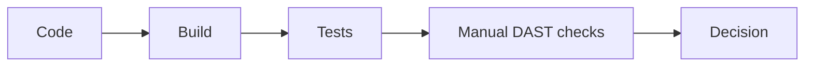

# Atelier 05 - Validation continue (tests, SAST, DAST) (.NET Framework 4.8)

## Mode compatibilite NET48

Cette variante est executable en .NET Framework 4.8 avec un hote HTTP de compatibilite. Les routes des ateliers NET10 sont reprises (methodes + chemins), avec des comportements vulnerables/securises reproduits en mode pedagogique net48.

## Pre-requis

- Etre positionne a la racine du depot `sdne`
- .NET Framework 4.8 (Developer Pack) installe
- PowerShell 5.1+


## Execution .NET Framework 4.8 avec dotnet

Oui, ces ateliers NET48 sont lances via la CLI `dotnet` car les projets sont au format SDK (`TargetFramework=net48`).

Pre-requis complementaires:
- .NET SDK installe (commande `dotnet` disponible)
- .NET Framework 4.8 Developer Pack installe

Commandes type:
```powershell
dotnet restore .\Atelier05.slnx
dotnet build .\Atelier05.slnx
dotnet run --project .\<Projet>\<Projet>.csproj --urls=http://localhost:5105
```

Si `HttpListener` retourne `Access denied` (Windows URL ACL), executer une fois en administrateur:
```powershell
netsh http add urlacl url=http://localhost:5105/ user=%USERNAME%
```
## Etape 1 - Restaurer la solution atelier

Objectif: preparer API et projet de tests.

Code source a observer:
- `05-NET48/SecurityValidationLab/Program.cs:23`
- `05-NET48/SecurityValidationLab.Tests/SecurityRegressionTests.cs:7`

```powershell
if (Test-Path .\05-NET48) { Set-Location .\05-NET48 }
dotnet restore .\Atelier05.slnx
```

Resultat attendu: restauration sans erreur.

## Etape 2 - Lancer l'API manuellement

Objectif: disposer d'une cible locale pour les checks DAST.

Code source a observer:
- `05-NET48/SecurityValidationLab/Program.cs:23`

```powershell
$BaseUrl = 'http://localhost:5105'
dotnet run --project .\SecurityValidationLab\SecurityValidationLab.csproj --urls=$BaseUrl
```

Resultat attendu: API active sur `http://localhost:5105`.

## Etape 3 - Verifier manuellement les endpoints critiques

Objectif: reproduire rapidement les cas XSS et open redirect.

Code source a observer:
- `05-NET48/SecurityValidationLab/Program.cs:29`
- `05-NET48/SecurityValidationLab/Program.cs:35`
- `05-NET48/SecurityValidationLab/Program.cs:42`
- `05-NET48/SecurityValidationLab/Program.cs:44`

```powershell
$BaseUrl = 'http://localhost:5105'
$xss = '<script>alert(1)</script>'

Invoke-WebRequest -Uri "$BaseUrl/vuln/xss?input=$([uri]::EscapeDataString($xss))" | Select-Object -ExpandProperty Content
Invoke-WebRequest -Uri "$BaseUrl/secure/xss?input=$([uri]::EscapeDataString($xss))" | Select-Object -ExpandProperty Content

Invoke-WebRequest -Uri "$BaseUrl/vuln/open-redirect?returnUrl=$([uri]::EscapeDataString('https://example.com'))" -MaximumRedirection 0 -ErrorAction SilentlyContinue | Select-Object StatusCode

try {
    Invoke-RestMethod -Uri "$BaseUrl/secure/open-redirect?returnUrl=$([uri]::EscapeDataString('https://example.com'))" -ErrorAction Stop
} catch {
    $_.Exception.Response.StatusCode.value__
}
```

Resultat attendu: comportement vulnerable observable uniquement sur endpoints `vuln`.

## Etape 4 - Executer les tests automatises

Objectif: valider la non-regression securite.

Code source a observer:
- `05-NET48/SecurityValidationLab.Tests/SecurityRegressionTests.cs:7`

```powershell
if (Test-Path .\05-NET48) { Set-Location .\05-NET48 }
dotnet test .\SecurityValidationLab.Tests\SecurityValidationLab.Tests.csproj
```

Resultat attendu: tests `Passed`.

## Etape 5 - Simuler un controle SAST local

Objectif: lancer une analyse statique minimale reproductible.

Code source a observer:
- `05-NET48/SecurityValidationLab/Program.cs:54`
- `05-NET48/SecurityValidationLab/SecurityValidationLab.csproj:4`

```powershell
if (Test-Path .\05-NET48) { Set-Location .\05-NET48 }
dotnet build .\SecurityValidationLab\SecurityValidationLab.csproj -warnaserror
```

Resultat attendu: build propre, sans avertissement non traite.

## Etape 6 - Simuler un controle DAST local

Objectif: enchainer des checks HTTP scriptables.

Code source a observer:
- `05-NET48/SecurityValidationLab/Program.cs:29`
- `05-NET48/SecurityValidationLab/Program.cs:44`

```powershell
$BaseUrl = 'http://localhost:5105'
$checks = @(
    "$BaseUrl/vuln/xss?input=test",
    "$BaseUrl/secure/xss?input=test",
    "$BaseUrl/secure/open-redirect?returnUrl=%2Fok"
)

foreach ($url in $checks) {
    $r = Invoke-WebRequest -Uri $url -Method Get
    "{0} -> {1}" -f $url, $r.StatusCode
}
```

Resultat attendu: tous les checks retounent `200` sur les cas valides.

## Verifications

- Tests unitaires/integration verts
- Cas manuels `vuln` vs `secure` distingues
- Pipeline local reproductible via commandes CI-friendly

## Depannage

- Si `dotnet test` echoue, executer `dotnet build` pour isoler l'erreur.
- Si DAST local echoue, verifier que l'API tourne toujours sur `5105`.

## Nettoyage / Reset

```powershell
# Dans le terminal API
# Ctrl+C

if (Test-Path .\05-NET48) { Set-Location .\05-NET48 }
dotnet clean .\Atelier05.slnx
```

## Diagramme Mermaid




## Tests NET48

Les tests fournis sur cette piste sont des smoke tests de validation d'execution (build + runner).


