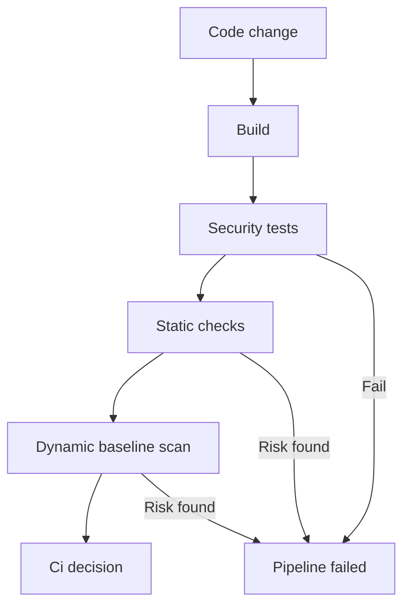

# Atelier 05 - Tests de securite automatises

## But

Automatiser la validation securite via tests d'integration, verification SAST/SCA et scan DAST baseline.

## Demarrage

```powershell
cd .\05
dotnet build .\Atelier05.slnx
dotnet test .\Atelier05.slnx
```

## Mode operatoire

### Etape 1 - Executer les tests de regression securite

Commande:
```powershell
dotnet test .\Atelier05.slnx
```

Controles verifies:
- encodage XSS sur `/secure/xss`
- blocage open redirect sur `/secure/open-redirect`
- politique mot de passe sur `/secure/register`
- presence des headers securite

### Etape 2 - Rejouer les requetes manuelles

Lancer l'API:
```powershell
dotnet run --project .\SecurityValidationLab\SecurityValidationLab.csproj
```

Executer les requetes de `SecurityValidationLab.http`:
- `/vuln/xss` puis `/secure/xss`
- `/vuln/open-redirect` puis `/secure/open-redirect`
- `/secure/register` avec mot de passe faible puis fort

Point a observer:
- les tests automatises couvrent exactement ces controles.

### Etape 3 - Executer le script SAST/SCA

Commande:
```powershell
.\scripts\run-sast.ps1
```

Ce script execute:
- build
- tests
- scan des dependances vulnerables (transitives incluses)

### Etape 4 - Executer le scan DAST baseline

Pre-requis:
- Docker actif
- API lancee localement

Commande:
```powershell
.\scripts\run-dast.ps1 -TargetUrl http://host.docker.internal:5000
```

Resultat attendu:
- rapport `zap-report.html` genere.

### Etape 5 - Integrer en CI

Reference:
- `pipeline/security-ci.yml`

Verification:
- la pipeline doit echouer si build/tests echouent ou si un scan dependance detecte un probleme.

## Script PowerShell des appels Web Service

```powershell
cd .\05
.\scripts\calls.ps1
```

## Diagramme Mermaid


