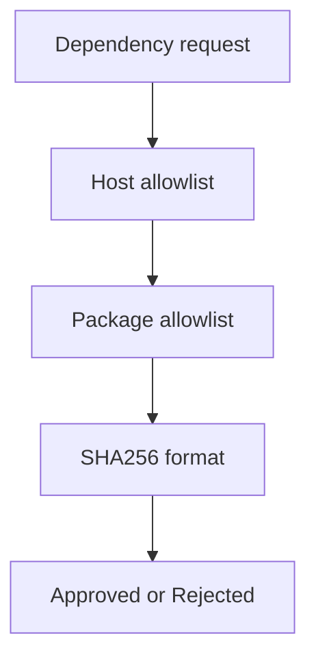

# Atelier 06 - Securite du code externe (.NET Framework 4.8)

## Pre-requis

- Etre positionne a la racine du depot `sdne`
- .NET Framework 4.8 (Developer Pack) installe
- PowerShell 5.1+

## Etape 1 - Initialiser et lancer

Objectif: demarrer l'API supply-chain locale.

Code source a observer:
- `06-NET48/SupplyChainSecurityLab/Program.cs:20`
- `06-NET48/SupplyChainSecurityLab/Security/SupplyChainPolicy.cs:3`

```powershell
if (Test-Path .\06-NET48) { Set-Location .\06-NET48 }
dotnet restore .\Atelier06.slnx
$BaseUrl = 'http://localhost:5106'
dotnet run --project .\SupplyChainSecurityLab\SupplyChainSecurityLab.csproj --urls=$BaseUrl
```

Resultat attendu: API active sur `http://localhost:5106`.

## Etape 2 - Secrets: hardcode vs variable d'environnement

Objectif: verifier la difference de gestion de secret.

Code source a observer:
- `06-NET48/SupplyChainSecurityLab/Program.cs:26`
- `06-NET48/SupplyChainSecurityLab/Program.cs:32`

```powershell
$BaseUrl = 'http://localhost:5106'
Invoke-RestMethod -Uri "$BaseUrl/vuln/config/secret" -Method Get

$env:UPSTREAM_API_KEY = 'local-workshop-key'
Invoke-RestMethod -Uri "$BaseUrl/secure/config/secret" -Method Get
```

Resultat attendu: endpoint secure indique `keyConfigured = true`.

## Etape 3 - Appels sortants controles

Objectif: comparer fetch non filtre et fetch filtre.

Code source a observer:
- `06-NET48/SupplyChainSecurityLab/Program.cs:43`
- `06-NET48/SupplyChainSecurityLab/Program.cs:55`
- `06-NET48/SupplyChainSecurityLab/Security/OutboundRequestGuard.cs:5`

```powershell
$BaseUrl = 'http://localhost:5106'
Invoke-RestMethod -Uri "$BaseUrl/vuln/outbound/fetch?url=$([uri]::EscapeDataString('https://example.com'))" -Method Get
Invoke-RestMethod -Uri "$BaseUrl/secure/outbound/fetch?url=$([uri]::EscapeDataString('https://example.com'))" -Method Get

try {
    Invoke-RestMethod -Uri "$BaseUrl/secure/outbound/fetch?url=$([uri]::EscapeDataString('http://127.0.0.1:80'))" -Method Get -ErrorAction Stop
} catch {
    $_.Exception.Response.StatusCode.value__
}
```

Resultat attendu: URL locale rejetee en mode secure.

## Etape 4 - Approbation de dependance

Objectif: tester controles allowlist + format SHA-256.

Code source a observer:
- `06-NET48/SupplyChainSecurityLab/Program.cs:82`
- `06-NET48/SupplyChainSecurityLab/Program.cs:92`
- `06-NET48/SupplyChainSecurityLab/Program.cs:133`
- `06-NET48/SupplyChainSecurityLab/Security/SupplyChainPolicy.cs:3`

```powershell
$BaseUrl = 'http://localhost:5106'

$bad = @{ packageId = 'unknown.pkg'; sourceUrl = 'https://evil.local/pkg'; sha256 = '123' } | ConvertTo-Json
try {
    Invoke-RestMethod -Uri "$BaseUrl/secure/dependency/approve" -Method Post -ContentType 'application/json' -Body $bad -ErrorAction Stop
} catch {
    $_.Exception.Response.StatusCode.value__
}

$shaBody = @{ payload = 'package-content-v1' } | ConvertTo-Json
$sha = Invoke-RestMethod -Uri "$BaseUrl/secure/dependency/sha256" -Method Post -ContentType 'application/json' -Body $shaBody
$sha.sha256
```

Resultat attendu: rejet de la demande invalide et hash SHA-256 valide calcule.

## Etape 5 - Tests automatiques

Objectif: valider les controles supply-chain via tests.

Code source a observer:
- `06-NET48/SupplyChainSecurityLab.Tests/SupplyChainSecurityTests.cs:7`

```powershell
if (Test-Path .\06-NET48) { Set-Location .\06-NET48 }
dotnet test .\SupplyChainSecurityLab.Tests\SupplyChainSecurityLab.Tests.csproj
```

Resultat attendu: tests `Passed`.

## Verifications

- Secret non expose en dur dans le mode secure
- URLs sortantes sensibles bloquees
- Validation package/source/hash active

## Depannage

- Si `secure/config/secret` retourne `false`, relancer API apres definir `UPSTREAM_API_KEY`.
- Si fetch HTTPS echoue, verifier acces Internet local.

## Nettoyage / Reset

```powershell
# Dans le terminal API
# Ctrl+C

if (Test-Path .\06-NET48) { Set-Location .\06-NET48 }
Remove-Item Env:\UPSTREAM_API_KEY -ErrorAction SilentlyContinue
dotnet clean .\Atelier06.slnx
```

## Diagramme Mermaid




