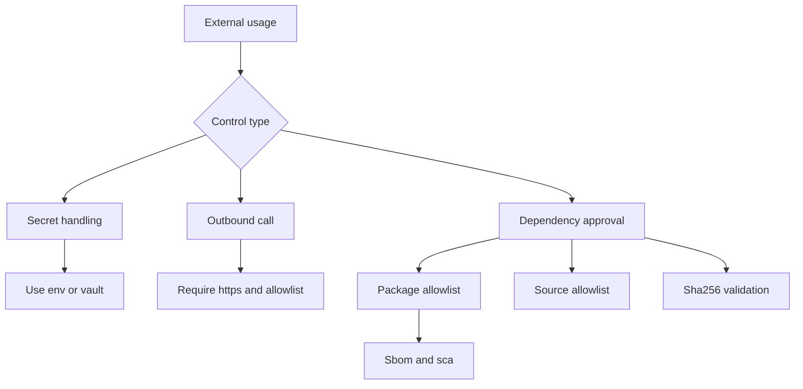

# Atelier 06 - Securite du code externe et supply chain

## But

Verifier les controles sur les dependances tierces, les appels API sortants et la gestion des secrets.

## Demarrage

```powershell
cd .\06
dotnet build .\Atelier06.slnx
dotnet test .\Atelier06.slnx
dotnet run --project .\SupplyChainSecurityLab\SupplyChainSecurityLab.csproj
```

## Mode operatoire

### Etape 1 - Secrets

Requetes:
```http
GET /vuln/config/secret HTTP/1.1
Host: localhost
```

```http
GET /secure/config/secret HTTP/1.1
Host: localhost
```

Resultat attendu:
- `vuln`: valeur de secret exposee.
- `secure`: indicateur de configuration sans fuite de secret.

### Etape 2 - Appels API sortants

Requete vulnerable:
```http
GET /vuln/outbound/fetch?url=http://example.com HTTP/1.1
Host: localhost
```

Requete securisee bloquee:
```http
GET /secure/outbound/fetch?url=http://example.com HTTP/1.1
Host: localhost
```

Requete securisee autorisee:
```http
GET /secure/outbound/fetch?url=https://jsonplaceholder.typicode.com/todos/1 HTTP/1.1
Host: localhost
```

Point a observer:
- enforcement HTTPS + host allowlist.

### Etape 3 - Provenance dependance

Requete vulnerable:
```http
POST /vuln/dependency/approve HTTP/1.1
Host: localhost
Content-Type: application/json

{"packageId":"Evil.Package","sourceUrl":"https://evil.example/feed/pkg.nupkg","sha256":"1234"}
```

Requete securisee invalide:
```http
POST /secure/dependency/approve HTTP/1.1
Host: localhost
Content-Type: application/json

{"packageId":"Evil.Package","sourceUrl":"https://evil.example/feed/pkg.nupkg","sha256":"1234"}
```

Requete securisee valide:
```http
POST /secure/dependency/approve HTTP/1.1
Host: localhost
Content-Type: application/json

{"packageId":"Polly","sourceUrl":"https://api.nuget.org/v3/index.json","sha256":"aaaaaaaaaaaaaaaaaaaaaaaaaaaaaaaaaaaaaaaaaaaaaaaaaaaaaaaaaaaaaaaa"}
```

### Etape 4 - Automatisation SCA + SBOM

Commandes:
```powershell
.\scripts\run-sca.ps1
.\scripts\generate-sbom.ps1
```

Resultat attendu:
- sortie de scan dependances vulnerables/obsoletes.
- fichier SBOM genere.

## Script PowerShell des appels Web Service

```powershell
cd .\06
.\scripts\calls.ps1
```

## Diagramme Mermaid


