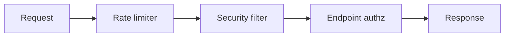

# Atelier 07 - Limiter l'exposition (.NET 10)

## Pre-requis

- Etre positionne a la racine du depot `sdne`
- .NET SDK 10.x installe
- PowerShell 5.1+

## Etape 1 - Initialiser et lancer

Objectif: demarrer l'API avec protections de surface d'attaque.

Code source a observer:
- `07-NET10/ExposureDefenseLab/Program.cs:5`
- `07-NET10/ExposureDefenseLab/Program.cs:29`
- `07-NET10/ExposureDefenseLab/Program.cs:47`

```powershell
if (Test-Path .\07-NET10) { Set-Location .\07-NET10 }
dotnet restore .\Atelier07.slnx
$BaseUrl = 'http://localhost:5107'
dotnet run --project .\ExposureDefenseLab\ExposureDefenseLab.csproj --urls=$BaseUrl
```

Resultat attendu: API active sur `http://localhost:5107`.

## Etape 2 - Endpoint admin: vuln vs secure

Objectif: observer la protection par cle API admin.

Code source a observer:
- `07-NET10/ExposureDefenseLab/Program.cs:53`
- `07-NET10/ExposureDefenseLab/Program.cs:59`

```powershell
$BaseUrl = 'http://localhost:5107'
Invoke-RestMethod -Uri "$BaseUrl/vuln/admin/ping" -Method Get

try {
    Invoke-RestMethod -Uri "$BaseUrl/secure/admin/ping" -Method Get -ErrorAction Stop
} catch {
    $_.Exception.Response.StatusCode.value__
}

$headers = @{ 'X-Admin-Key' = 'workshop-admin-key' }
Invoke-RestMethod -Uri "$BaseUrl/secure/admin/ping" -Method Get -Headers $headers
```

Resultat attendu: acces secure autorise uniquement avec `X-Admin-Key` valide.

## Etape 3 - Filtrage WAF-like

Objectif: verifier blocage de patterns malveillants.

Code source a observer:
- `07-NET10/ExposureDefenseLab/Program.cs:32`
- `07-NET10/ExposureDefenseLab/Program.cs:37`

```powershell
$BaseUrl = 'http://localhost:5107'
Invoke-RestMethod -Uri "$BaseUrl/secure/search?q=normal-query" -Method Get

try {
    Invoke-RestMethod -Uri "$BaseUrl/secure/search?q=$([uri]::EscapeDataString('<script>alert(1)</script>'))" -Method Get -ErrorAction Stop
} catch {
    $_.Exception.Response.StatusCode.value__
}
```

Resultat attendu: requete suspecte bloquee en `403`.

## Etape 4 - Validation metadata upload

Objectif: verifier controles type/taille/nom de fichier.

Code source a observer:
- `07-NET10/ExposureDefenseLab/Program.cs:88`
- `07-NET10/ExposureDefenseLab/Program.cs:97`

```powershell
$BaseUrl = 'http://localhost:5107'

$ok = @{ fileName = 'doc.pdf'; contentType = 'application/pdf'; size = 1200 } | ConvertTo-Json
Invoke-RestMethod -Uri "$BaseUrl/secure/upload/meta" -Method Post -ContentType 'application/json' -Body $ok

$bad = @{ fileName = '..\\evil.exe'; contentType = 'application/octet-stream'; size = 99999999 } | ConvertTo-Json
try {
    Invoke-RestMethod -Uri "$BaseUrl/secure/upload/meta" -Method Post -ContentType 'application/json' -Body $bad -ErrorAction Stop
} catch {
    $_.Exception.Response.StatusCode.value__
}
```

Resultat attendu: payload invalide refuse.

## Etape 5 - Rate limiting

Objectif: observer la limitation du debit.

Code source a observer:
- `07-NET10/ExposureDefenseLab/Program.cs:5`
- `07-NET10/ExposureDefenseLab/Program.cs:7`
- `07-NET10/ExposureDefenseLab/Program.cs:15`

```powershell
$BaseUrl = 'http://localhost:5107'
1..8 | ForEach-Object {
    try {
        $r = Invoke-WebRequest -Uri "$BaseUrl/vuln/search?q=test$_" -Method Get -ErrorAction Stop
        "Req $_ -> $($r.StatusCode)"
    } catch {
        "Req $_ -> $($_.Exception.Response.StatusCode.value__)"
    }
}
```

Resultat attendu: certaines requetes passent en `429`.

## Verifications

- Endpoint admin secure protege
- Filtrage de pattern malveillant actif
- Validation upload appliquee
- Rate limiter actif

## Depannage

- Si toutes les requetes sont bloquees, attendre 10 secondes puis retester (fenetre rate limit).
- Si acces admin secure refuse, verifier la cle `X-Admin-Key`.

## Nettoyage / Reset

```powershell
# Dans le terminal API
# Ctrl+C

if (Test-Path .\07-NET10) { Set-Location .\07-NET10 }
dotnet clean .\Atelier07.slnx
```

## Diagramme Mermaid




