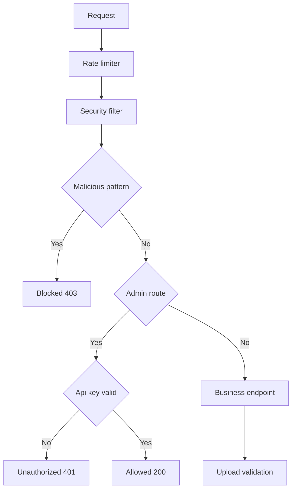

# Atelier 07 - Limiter la surface d'exposition

## But

Mettre en place des defenses runtime: controle admin, filtrage, validation upload, limitation de debit.

## Demarrage

```powershell
cd .\07
dotnet build .\Atelier07.slnx
dotnet test .\Atelier07.slnx
dotnet run --project .\ExposureDefenseLab\ExposureDefenseLab.csproj
```

## Mode operatoire

### Etape 1 - Endpoint admin

Requetes:
```http
GET /vuln/admin/ping HTTP/1.1
Host: localhost
```

```http
GET /secure/admin/ping HTTP/1.1
Host: localhost
```

```http
GET /secure/admin/ping HTTP/1.1
Host: localhost
X-Admin-Key: workshop-admin-key
```

Resultat attendu:
- `vuln`: acces direct.
- `secure`: `401` sans cle, `200` avec cle.

### Etape 2 - Filtrage type WAF

Requetes:
```http
GET /vuln/search?q=<script>alert(1)</script> HTTP/1.1
Host: localhost
```

```http
GET /secure/search?q=<script>alert(1)</script> HTTP/1.1
Host: localhost
```

Resultat attendu:
- `secure`: `403` sur pattern malveillant.

### Etape 3 - Validation upload

Requete vulnerable:
```http
POST /vuln/upload/meta HTTP/1.1
Host: localhost
Content-Type: application/json

{"fileName":"payload.exe","contentType":"application/x-msdownload","size":1000}
```

Requete securisee rejet:
```http
POST /secure/upload/meta HTTP/1.1
Host: localhost
Content-Type: application/json

{"fileName":"payload.exe","contentType":"application/x-msdownload","size":1000}
```

Requete securisee valide:
```http
POST /secure/upload/meta HTTP/1.1
Host: localhost
Content-Type: application/json

{"fileName":"document.pdf","contentType":"application/pdf","size":34567}
```

### Etape 4 - Rate limiting

Action:
- envoyer plus de 5 requetes en moins de 10 secondes vers une route.

Resultat attendu:
- reponses `429 Too Many Requests` au-dela du quota.

## Automatisation

```powershell
.\scripts\run-defense-checks.ps1
```

## Script PowerShell des appels Web Service

```powershell
cd .\07
.\scripts\calls.ps1
```

## Diagramme Mermaid


