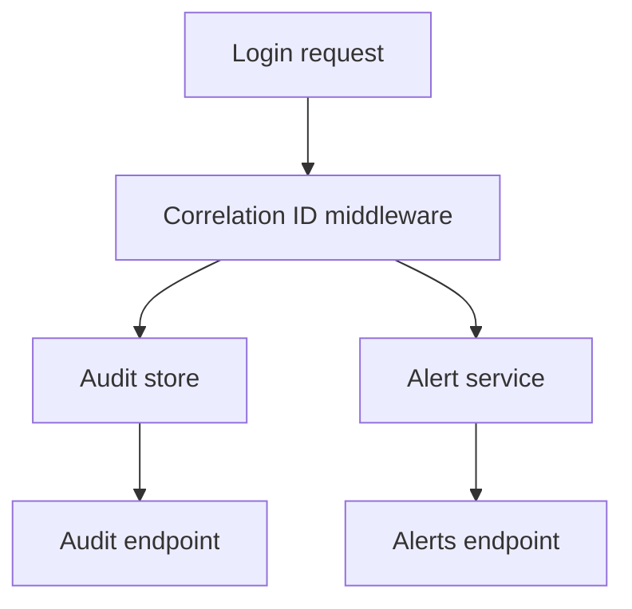

# Atelier 08 - Monitoring securite (.NET 10)

## Pre-requis

- Etre positionne a la racine du depot `sdne`
- .NET SDK 10.x installe
- PowerShell 5.1+

## Etape 1 - Initialiser et lancer

Objectif: demarrer l'API de monitoring.

Code source a observer:
- `08-NET10/SecurityMonitoringLab/Program.cs:15`
- `08-NET10/SecurityMonitoringLab/Program.cs:29`

```powershell
if (Test-Path .\08-NET10) { Set-Location .\08-NET10 }
dotnet restore .\Atelier08.slnx
$BaseUrl = 'http://localhost:5108'
dotnet run --project .\SecurityMonitoringLab\SecurityMonitoringLab.csproj --urls=$BaseUrl
```

Resultat attendu: API active sur `http://localhost:5108`.

## Etape 2 - Login vulnerable vs secure

Objectif: comparer journalisation et audit.

Code source a observer:
- `08-NET10/SecurityMonitoringLab/Program.cs:35`
- `08-NET10/SecurityMonitoringLab/Program.cs:49`
- `08-NET10/SecurityMonitoringLab/Monitoring/AuditStore.cs:7`
- `08-NET10/SecurityMonitoringLab/Monitoring/SecurityAlertService.cs:8`

```powershell
$BaseUrl = 'http://localhost:5108'
$badLogin = @{ username = 'alice'; password = 'wrong' } | ConvertTo-Json
$okLogin = @{ username = 'alice'; password = 'Password123!' } | ConvertTo-Json

Invoke-RestMethod -Uri "$BaseUrl/vuln/login" -Method Post -ContentType 'application/json' -Body $badLogin
Invoke-RestMethod -Uri "$BaseUrl/secure/login" -Method Post -ContentType 'application/json' -Headers @{ 'X-Correlation-ID' = 'corr-001' } -Body $badLogin
Invoke-RestMethod -Uri "$BaseUrl/secure/login" -Method Post -ContentType 'application/json' -Headers @{ 'X-Correlation-ID' = 'corr-002' } -Body $okLogin
```

Resultat attendu: reponses avec `correlationId` et etat `authenticated`.

## Etape 3 - Consulter audit trail

Objectif: verifier les evenements de securite produits.

Code source a observer:
- `08-NET10/SecurityMonitoringLab/Program.cs:74`
- `08-NET10/SecurityMonitoringLab/Monitoring/AuditStore.cs:15`

```powershell
$BaseUrl = 'http://localhost:5108'
Invoke-RestMethod -Uri "$BaseUrl/secure/audit/events" -Method Get
```

Resultat attendu: liste d'evenements `auth.failure` et `auth.success`.

## Etape 4 - Consulter alertes

Objectif: observer la remontee d'alertes sur echecs d'authentification.

Code source a observer:
- `08-NET10/SecurityMonitoringLab/Program.cs:79`
- `08-NET10/SecurityMonitoringLab/Monitoring/SecurityAlertService.cs:8`

```powershell
$BaseUrl = 'http://localhost:5108'
Invoke-RestMethod -Uri "$BaseUrl/secure/alerts" -Method Get
```

Resultat attendu: compteur d'alertes non vide apres plusieurs echecs.

## Etape 5 - Reset alertes (admin)

Objectif: verifier protection de l'action SOC sensible.

Code source a observer:
- `08-NET10/SecurityMonitoringLab/Program.cs:84`
- `08-NET10/SecurityMonitoringLab/Program.cs:90`

```powershell
$BaseUrl = 'http://localhost:5108'

try {
    Invoke-RestMethod -Uri "$BaseUrl/secure/admin/reset-alerts" -Method Post -ErrorAction Stop
} catch {
    $_.Exception.Response.StatusCode.value__
}

$headers = @{ 'X-SOC-Key' = 'soc-admin-key' }
Invoke-RestMethod -Uri "$BaseUrl/secure/admin/reset-alerts" -Method Post -Headers $headers
Invoke-RestMethod -Uri "$BaseUrl/secure/alerts" -Method Get
```

Resultat attendu: reset autorise uniquement avec cle SOC.

## Etape 6 - Executer les tests

Objectif: valider les scenarios de monitoring automatiquement.

Code source a observer:
- `08-NET10/SecurityMonitoringLab.Tests/SecurityMonitoringTests.cs:7`

```powershell
if (Test-Path .\08-NET10) { Set-Location .\08-NET10 }
dotnet test .\SecurityMonitoringLab.Tests\SecurityMonitoringLab.Tests.csproj
```

Resultat attendu: tests `Passed`.

## Verifications

- Correlation ID present dans les flux secure
- Audit events disponibles
- Alertes generees puis resettees via admin key

## Depannage

- Si reset secure reste `401`, verifier `X-SOC-Key`.
- Si audit vide, rejouer au moins un login secure.

## Nettoyage / Reset

```powershell
# Dans le terminal API
# Ctrl+C

if (Test-Path .\08-NET10) { Set-Location .\08-NET10 }
dotnet clean .\Atelier08.slnx
```

## Diagramme Mermaid




