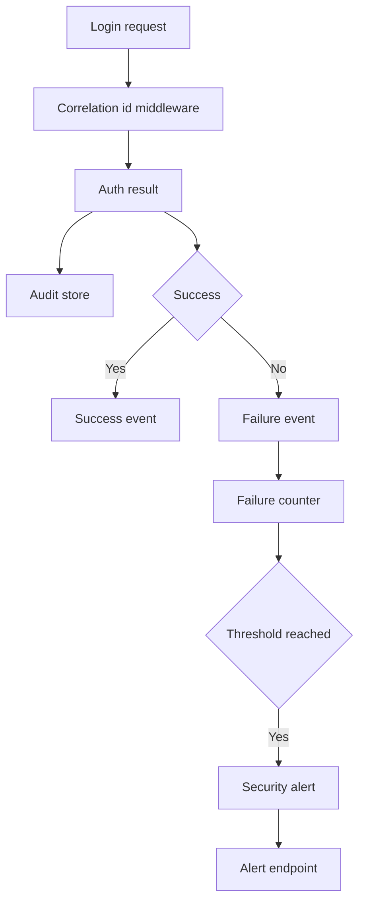

# Atelier 08 - Monitoring securite et reponse

## But

Mettre en place correlation de requete, audit trail, alerting et protection des actions admin de supervision.

## Demarrage

```powershell
cd .\08
dotnet build .\Atelier08.slnx
dotnet test .\Atelier08.slnx
dotnet run --project .\SecurityMonitoringLab\SecurityMonitoringLab.csproj
```

## Mode operatoire

### Etape 1 - Login vulnerable

Requete:
```http
POST /vuln/login HTTP/1.1
Host: localhost
Content-Type: application/json

{"username":"alice","password":"bad-password"}
```

Point a observer:
- la version vulnerable journalise un secret sensible.

### Etape 2 - Login securise avec correlation

Requete avec correlation explicite:
```http
POST /secure/login HTTP/1.1
Host: localhost
X-Correlation-ID: req-12345
Content-Type: application/json

{"username":"alice","password":"bad-password"}
```

Requete sans correlation explicite:
```http
POST /secure/login HTTP/1.1
Host: localhost
Content-Type: application/json

{"username":"alice","password":"Password123!"}
```

Resultat attendu:
- header de reponse `X-Correlation-ID` present dans les deux cas.

### Etape 3 - Audit trail

Requete:
```http
GET /secure/audit/events HTTP/1.1
Host: localhost
```

Resultat attendu:
- presence d'evenements `auth.failure` et/ou `auth.success`.

### Etape 4 - Alerting

Action:
- executer 3 logins en echec pour le meme utilisateur.

Requete:
```http
GET /secure/alerts HTTP/1.1
Host: localhost
```

Resultat attendu:
- alerte `multiple_failed_logins:<user>`.

### Etape 5 - Action admin de supervision

Requetes:
```http
POST /secure/admin/reset-alerts HTTP/1.1
Host: localhost
```

```http
POST /secure/admin/reset-alerts HTTP/1.1
Host: localhost
X-SOC-Key: soc-admin-key
```

Resultat attendu:
- `401` sans cle.
- `200` avec cle.

## Automatisation

```powershell
.\scripts\run-monitoring-checks.ps1
```

## Script PowerShell des appels Web Service

```powershell
cd .\08
.\scripts\calls.ps1
```

## Diagramme Mermaid


