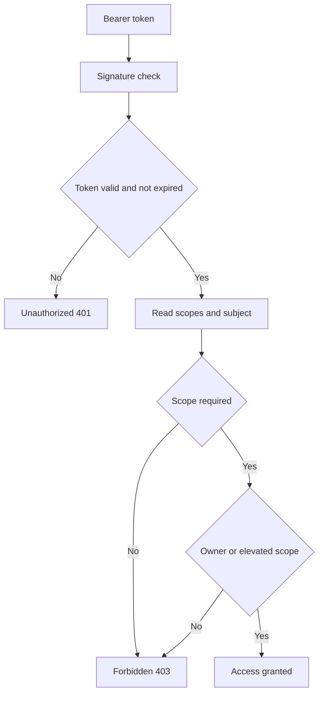

# Atelier 09 - Authentification et autorisation avancees

## But

Verifier l'integrite d'un token signe, appliquer des scopes, et proteger l'acces objet.

## Demarrage

```powershell
cd .\09
dotnet build .\Atelier09.slnx
dotnet test .\Atelier09.slnx
dotnet run --project .\AuthzHardeningLab\AuthzHardeningLab.csproj
```

## Mode operatoire

### Etape 1 - Token vulnerable non signe

Requete:
```http
POST /vuln/auth/token HTTP/1.1
Host: localhost
Content-Type: application/json

{"username":"alice","scope":"docs.read"}
```

Point a observer:
- le token n'a aucune garantie d'integrite.

### Etape 2 - Token securise signe

Requete:
```http
POST /secure/auth/token HTTP/1.1
Host: localhost
Content-Type: application/json

{"username":"alice","scope":"docs.read"}
```

Conserver la valeur `token`.

### Etape 3 - Controle d'acces objet (BOLA/IDOR)

Requete vulnerable:
```http
GET /vuln/docs/2?username=alice HTTP/1.1
Host: localhost
```

Requete securisee:
```http
GET /secure/docs/2 HTTP/1.1
Host: localhost
Authorization: Bearer <token_alice_docs.read>
```

Resultat attendu:
- `vuln`: lecture non autorisee possible.
- `secure`: `403` si utilisateur non proprietaire.

### Etape 4 - Scope d'action sensible

Obtenir token avec publication:
```http
POST /secure/auth/token HTTP/1.1
Host: localhost
Content-Type: application/json

{"username":"bob","scope":"docs.read docs.publish"}
```

Publier:
```http
POST /secure/docs/2/publish HTTP/1.1
Host: localhost
Authorization: Bearer <token_bob_docs.read_docs.publish>
```

Resultat attendu:
- publication autorisee uniquement si scope + ownership valides.

## Automatisation

```powershell
.\scripts\run-authz-checks.ps1
```

## Script PowerShell des appels Web Service

```powershell
cd .\09
.\scripts\calls.ps1
```

## Diagramme Mermaid


