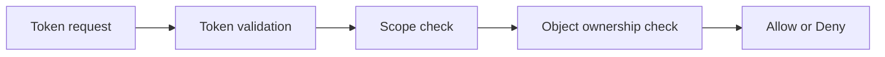

# Atelier 09 - Durcissement AuthN/AuthZ

## Pre-requis

- Etre positionne a la racine du depot `sdne`
- .NET SDK 10.x installe
- PowerShell 5.1+

## Etape 1 - Initialiser et lancer

Objectif: demarrer l'API de hardening AuthN/AuthZ.

Code source a observer:
- `09/AuthzHardeningLab/Program.cs:15`
- `09/AuthzHardeningLab/Security/TokenService.cs:10`
- `09/AuthzHardeningLab/Security/DocumentStore.cs:3`

```powershell
if (Test-Path .\09) { Set-Location .\09 }
dotnet restore .\Atelier09.slnx
$BaseUrl = 'http://localhost:5109'
dotnet run --project .\AuthzHardeningLab\AuthzHardeningLab.csproj --urls=$BaseUrl
```

Resultat attendu: API active sur `http://localhost:5109`.

## Etape 2 - Emettre un token vulnerable et un token secure

Objectif: comparer format non signe et token valide.

Code source a observer:
- `09/AuthzHardeningLab/Program.cs:21`
- `09/AuthzHardeningLab/Program.cs:27`
- `09/AuthzHardeningLab/Security/TokenService.cs:18`

```powershell
$BaseUrl = 'http://localhost:5109'

$vulnReq = @{ username = 'alice'; scope = 'docs.read' } | ConvertTo-Json
Invoke-RestMethod -Uri "$BaseUrl/vuln/auth/token" -Method Post -ContentType 'application/json' -Body $vulnReq

$secureReq = @{ username = 'alice'; scope = 'docs.read docs.publish' } | ConvertTo-Json
$secureToken = Invoke-RestMethod -Uri "$BaseUrl/secure/auth/token" -Method Post -ContentType 'application/json' -Body $secureReq
$Bearer = $secureToken.token
```

Resultat attendu: token secure recu pour les appels proteges.

## Etape 3 - Controle d'acces objet (lecture document)

Objectif: verifier scope + ownership.

Code source a observer:
- `09/AuthzHardeningLab/Program.cs:49`
- `09/AuthzHardeningLab/Security/TokenService.cs:64`
- `09/AuthzHardeningLab/Security/DocumentStore.cs:12`

```powershell
$BaseUrl = 'http://localhost:5109'
$headers = @{ Authorization = "Bearer $Bearer" }
Invoke-RestMethod -Uri "$BaseUrl/secure/docs/1" -Method Get -Headers $headers

try {
    Invoke-RestMethod -Uri "$BaseUrl/secure/docs/2" -Method Get -Headers $headers -ErrorAction Stop
} catch {
    $_.Exception.Response.StatusCode.value__
}
```

Resultat attendu: document hors perimetre refuse (`403`) sauf scope/ownership adequat.

## Etape 4 - Publication document avec scope

Objectif: verifier la politique `docs.publish` + ownership.

Code source a observer:
- `09/AuthzHardeningLab/Program.cs:87`
- `09/AuthzHardeningLab/Security/TokenService.cs:64`

```powershell
$BaseUrl = 'http://localhost:5109'
$headers = @{ Authorization = "Bearer $Bearer" }
Invoke-RestMethod -Uri "$BaseUrl/secure/docs/1/publish" -Method Post -Headers $headers
```

Resultat attendu: publication autorisee si le token et le proprietaire sont valides.

## Etape 5 - Comparaison endpoint vulnerable

Objectif: observer l'absence de controle robuste sur endpoint vuln.

Code source a observer:
- `09/AuthzHardeningLab/Program.cs:33`

```powershell
$BaseUrl = 'http://localhost:5109'
Invoke-RestMethod -Uri "$BaseUrl/vuln/docs/2?username=alice" -Method Get
```

Resultat attendu: lecture possible en mode `vuln` sans verifications equivalentes.

## Etape 6 - Executer les tests

Objectif: valider automatiquement les controles AuthN/AuthZ.

Code source a observer:
- `09/AuthzHardeningLab.Tests/AuthzHardeningTests.cs:8`

```powershell
if (Test-Path .\09) { Set-Location .\09 }
dotnet test .\AuthzHardeningLab.Tests\AuthzHardeningLab.Tests.csproj
```

Resultat attendu: tests `Passed`.

## Verifications

- Token secure requis pour endpoints secure
- Scopes appliques (`docs.read`, `docs.publish`)
- Autorisation objet appliquee (owner/admin)

## Depannage

- Si `401`, verifier format `Authorization: Bearer <token>`.
- Si `403`, verifier scopes demandes lors de l'emission du token.

## Nettoyage / Reset

```powershell
# Dans le terminal API
# Ctrl+C

if (Test-Path .\09) { Set-Location .\09 }
dotnet clean .\Atelier09.slnx
```

## Diagramme Mermaid




