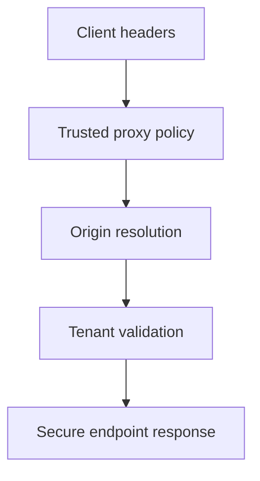

# Atelier 10 - Validation perimetrique (.NET Framework 4.8)

## Mode compatibilite NET48

Cette variante est executable en .NET Framework 4.8 avec un hote HTTP de compatibilite. Les routes des ateliers NET10 sont reprises (methodes + chemins), avec des comportements vulnerables/securises reproduits en mode pedagogique net48.

## Pre-requis

- Etre positionne a la racine du depot `sdne`
- .NET Framework 4.8 (Developer Pack) installe
- PowerShell 5.1+
- (Optionnel) Docker Desktop pour scenario compose/nginx


## Execution .NET Framework 4.8 avec dotnet

Oui, ces ateliers NET48 sont lances via la CLI `dotnet` car les projets sont au format SDK (`TargetFramework=net48`).

Pre-requis complementaires:
- .NET SDK installe (commande `dotnet` disponible)
- .NET Framework 4.8 Developer Pack installe

Commandes type:
```powershell
dotnet restore .\Atelier10.slnx
dotnet build .\Atelier10.slnx
dotnet run --project .\<Projet>\<Projet>.csproj --urls=http://localhost:5110
```

Si `HttpListener` retourne `Access denied` (Windows URL ACL), executer une fois en administrateur:
```powershell
netsh http add urlacl url=http://localhost:5110/ user=%USERNAME%
```
## Etape 1 - Initialiser et lancer

Objectif: demarrer l'API perimetrique locale.

Code source a observer:
- `10-NET48/PerimeterValidationLab/Program.cs:14`
- `10-NET48/PerimeterValidationLab/Program.cs:5`

```powershell
if (Test-Path .\10-NET48) { Set-Location .\10-NET48 }
dotnet restore .\Atelier10.slnx
$BaseUrl = 'http://localhost:5110'
dotnet run --project .\PerimeterValidationLab\PerimeterValidationLab.csproj --urls=$BaseUrl
```

Resultat attendu: API active sur `http://localhost:5110`.

## Etape 2 - Header injection sur lien de reset

Objectif: comparer resolution d'origine vulnerable et securisee.

Code source a observer:
- `10-NET48/PerimeterValidationLab/Program.cs:20`
- `10-NET48/PerimeterValidationLab/Program.cs:36`
- `10-NET48/PerimeterValidationLab/Security/TrustedProxyPolicy.cs:11`

```powershell
$BaseUrl = 'http://localhost:5110'
$headers = @{ 'X-Forwarded-Host' = 'evil.example'; 'X-Forwarded-Proto' = 'http' }

Invoke-RestMethod -Uri "$BaseUrl/vuln/links/reset-password?user=alice" -Method Get -Headers $headers
try {
    Invoke-RestMethod -Uri "$BaseUrl/secure/links/reset-password?user=alice" -Method Get -Headers $headers -ErrorAction Stop
} catch {
    $_.Exception.Response.StatusCode.value__
}
```

Resultat attendu: endpoint secure rejette origine non fiable.

## Etape 3 - Resolution tenant

Objectif: verifier protection de la resolution multi-tenant par host.

Code source a observer:
- `10-NET48/PerimeterValidationLab/Program.cs:52`
- `10-NET48/PerimeterValidationLab/Program.cs:64`
- `10-NET48/PerimeterValidationLab/Security/TrustedProxyPolicy.cs:46`

```powershell
$BaseUrl = 'http://localhost:5110'
$headersBad = @{ 'X-Forwarded-Host' = 'unknown-tenant.local'; 'X-Forwarded-Proto' = 'https' }

Invoke-RestMethod -Uri "$BaseUrl/vuln/tenant/home" -Method Get -Headers $headersBad
try {
    Invoke-RestMethod -Uri "$BaseUrl/secure/tenant/home" -Method Get -Headers $headersBad -ErrorAction Stop
} catch {
    $_.Exception.Response.StatusCode.value__
}
```

Resultat attendu: tenant inconnu refuse en mode secure (`403` ou `400`).

## Etape 4 - Diagnostics des metadonnees de requete

Objectif: verifier ce que l'API conserve des headers forwarded.

Code source a observer:
- `10-NET48/PerimeterValidationLab/Program.cs:84`
- `10-NET48/PerimeterValidationLab/Security/TrustedProxyPolicy.cs:11`

```powershell
$BaseUrl = 'http://localhost:5110'
$headers = @{ 'X-Forwarded-Host' = 'app.example.local'; 'X-Forwarded-Proto' = 'https' }
Invoke-RestMethod -Uri "$BaseUrl/secure/diagnostics/request-meta" -Method Get -Headers $headers
```

Resultat attendu: JSON de diagnostic avec `resolved.Valid` et details de resolution.

## Etape 5 - Option Docker compose (perimetre local)

Objectif: executer le scenario proxy + application.

Code source a observer:
- `10-NET48/infra/docker-compose.yml:1`
- `10-NET48/infra/nginx.conf:1`

```powershell
if (Test-Path .\10-NET48\infra) { Set-Location .\10-NET48\infra } elseif (Test-Path .\infra) { Set-Location .\infra }
docker compose up -d
```

Check:

```powershell
docker compose ps
```

Resultat attendu: services `Up`.

## Etape 6 - Executer les tests

Objectif: valider automatiquement les regles perimetriques.

Code source a observer:
- `10-NET48/PerimeterValidationLab.Tests/PerimeterValidationTests.cs:6`

```powershell
if (Test-Path .\10-NET48) { Set-Location .\10-NET48 }
dotnet test .\PerimeterValidationLab.Tests\PerimeterValidationLab.Tests.csproj
```

Resultat attendu: tests `Passed`.

## Verifications

- Les endpoints `secure/*` n'acceptent pas aveuglement `X-Forwarded-*`
- Tenant resolution durcie
- Diagnostics exploitables pour audit perimetrique

## Depannage

- Si Docker indisponible, ignorer l'etape 5 (optionnelle).
- Si endpoint secure rejette tout, verifier headers et host attendus dans la policy.

## Nettoyage / Reset

```powershell
# Dans le terminal API
# Ctrl+C

if (Test-Path .\10-NET48) { Set-Location .\10-NET48 }
if (Test-Path .\infra) { Set-Location .\infra }
docker compose down

Set-Location ..
dotnet clean .\Atelier10.slnx
```

## Diagramme Mermaid




## Tests NET48

Les tests fournis sur cette piste sont des smoke tests de validation d'execution (build + runner).


