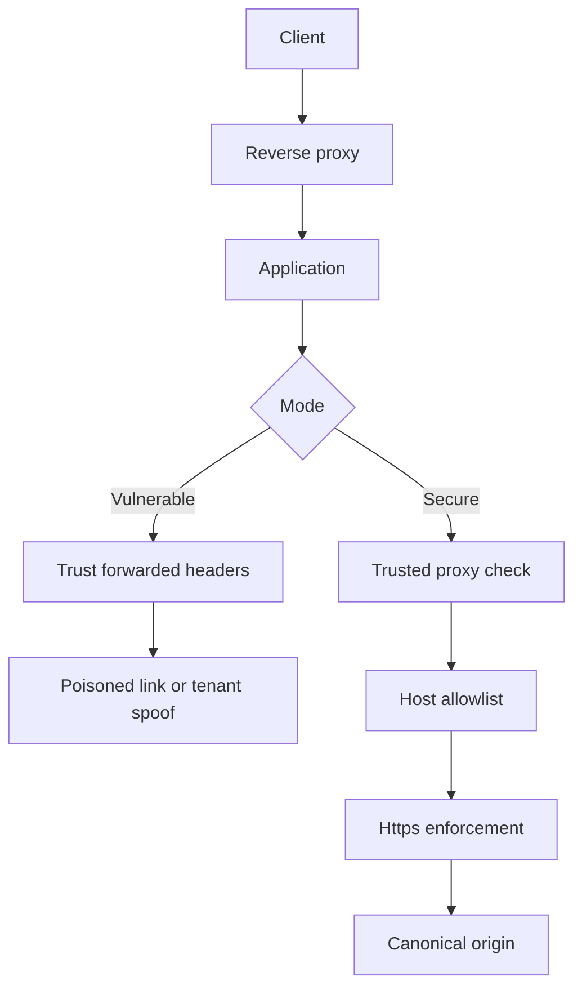

# Atelier 10 - Validation perimetrique (headers, proxy, DMZ)

## But

Valider les protections contre l'injection d'en-tetes HTTP et verifier la bonne prise en compte des headers forwarded derriere un proxy.

## Demarrage

```powershell
cd .\10
dotnet build .\Atelier10.slnx
dotnet test .\Atelier10.slnx
dotnet run --project .\PerimeterValidationLab\PerimeterValidationLab.csproj
```

## Mode operatoire

### Etape 1 - Injection de headers sur lien de reset

Requete vulnerable:
```http
GET /vuln/links/reset-password?user=alice HTTP/1.1
Host: localhost
X-Forwarded-Host: evil.example
X-Forwarded-Proto: http
```

Resultat attendu:
- le lien genere pointe vers `http://evil.example/...`.

Point a observer:
- confiance excessive dans des headers controles par le client.

### Etape 2 - Version securisee

Requete securisee avec host autorise:
```http
GET /secure/links/reset-password?user=alice HTTP/1.1
Host: app.contoso.local
X-Forwarded-Proto: https
```

Requete securisee avec host non autorise:
```http
GET /secure/links/reset-password?user=alice HTTP/1.1
Host: evil.example
```

Resultat attendu:
- host autorise: `200` + lien `https://app.contoso.local/...`
- host non autorise: `400`

### Etape 3 - Resolution tenant

Requete vulnerable:
```http
GET /vuln/tenant/home HTTP/1.1
Host: localhost
X-Forwarded-Host: evil.example
```

Requete securisee:
```http
GET /secure/tenant/home HTTP/1.1
Host: app.contoso.local
X-Forwarded-Proto: https
```

Resultat attendu:
- `vuln`: tenant force par header.
- `secure`: only allowlist tenant.

### Etape 4 - Diagnostic de forwarding

Requete:
```http
GET /secure/diagnostics/request-meta HTTP/1.1
Host: app.contoso.local
X-Forwarded-Proto: https
```

Point a observer:
- metadata de requete et decision de validation.

### Etape 5 - Verification proxy et capture reseau

Support:
- `scripts/proxy-capture-playbook.md`
- `infra/docker-compose.yml`
- `infra/nginx.conf`

Commandes:
```powershell
cd .\infra
docker compose up --build
```

Ensuite:
- rejouer les requetes via proxy
- capturer et analyser les headers avec Wireshark/tcpdump

## Automatisation

```powershell
.\scripts\run-perimeter-checks.ps1
```

## Script PowerShell des appels Web Service

```powershell
cd .\10
.\scripts\calls.ps1
```

## Diagramme Mermaid


